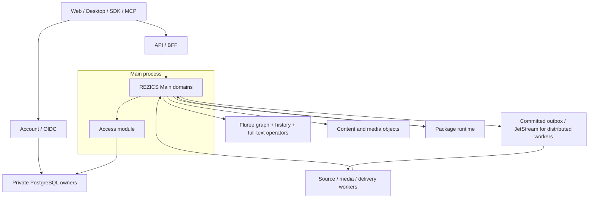

# Selected architecture

## Product foundation

The first foundation is Space (Realm and Zone), context-aware classification and
ratings, and a maintained REZICS Main Version. Books, software, media, recipes,
Skills and Prompts exercise the same identity, provenance, content and query
contracts. Collections, reading lists, comments, wikis, character relationships
and causal/background graphs compose these capabilities rather than create
disconnected content silos.

## System layers

| Layer | Contract |
| --- | --- |
| Meaning | RDF resources, typed values, concepts, assertions, contextual interpretations and source mappings. |
| Authority | Private authentication, explicit representation, grantability, current disclosure and accountable domain commands. |
| Product state | Main versions, content selection, publication, source adoption, membership and lifecycle. |
| Query | Fluree graph plans include full-text matching, context resolution, filters, ranking and bounded aggregation. |
| Storage | Fluree facts/history; PostgreSQL for private account/control and justified operational data; object storage for bytes. |
| Execution | Account, Main, package runtime and workers with explicit interfaces; Access initially runs inside Main behind its own interface. |

## Selected technical direction

Account uses TypeScript/Bun, Elysia and Better Auth behind OIDC. Main and new
domain/query integrations use Rust/Tokio/Axum. HTTP contracts use OpenAPI with a
qualified generator profile; React, generated clients and MCP share commands.
Fluree runs as a service with reusable HTTP clients. Embed its Rust engine only
for a justified integration boundary, not once per arbitrary application replica.

Full-text remains inside Fluree evaluation. Start with native full-text and
versioned CJK analyzers; extend operators/Graph Sources and use Tantivy when
required capabilities justify it. A detached OpenSearch-first query path is not
the target. See [search](../contracts/search.md).

## Consistency

Local transactions protect aggregate invariants, operation receipts and events.
Cross-store effects use explicit staged workflows and reconciliation. A service
with two databases does not acquire a distributed transaction automatically.
Read-after-write carries a source-specific commit fence. Exact multi-source
exports seal their dependencies; a list of independently observed heads is not
an atomic snapshot. [Commands](../contracts/commands.md) owns these guarantees.

## Scope and realization

The system is a breaking redesign. Fresh installation and source-native conversion
are required; retaining old schemas, IDs, URLs, SDKs or dual-write migration paths
is not a product requirement. New identity continuity, revision retention and
backup recovery remain mandatory within the new system.

Physical growth remains possible through bounded aggregates, owner routing,
independent ledger groups and explicit migration epochs. Initial delivery is not
conditional on billion-row benchmarks or a distributed control plane.
