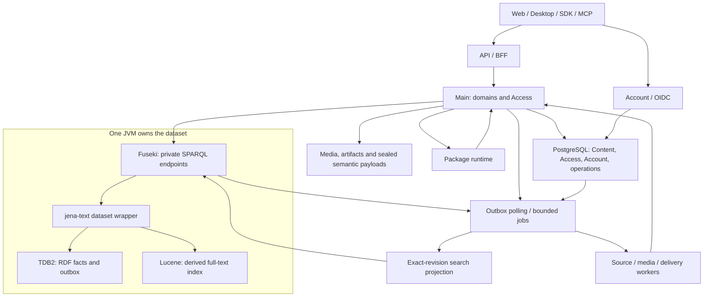

# Selected architecture

## Fast startup and product foundation

The selected startup architecture is **PostgreSQL + Apache Jena Fuseki/TDB2 +
embedded jena-text/Lucene**, confirmed on 2026-09-24. PostgreSQL owns document
content and operational transactions; Jena owns semantic aggregates and executes
combined graph/text queries. Object storage holds media, artifacts and large
sealed payloads. All required components must be self-hosted open-source or
suitable source-available software; purely proprietary dependencies are excluded.
Start with one graph service, one product dataset and a small authenticated
vertical journey. The
[installation guide](../operations/installation.md) starts the graph substrate;
[the delivery sequence](../plan/README.md) adds actual REZICS commands and clients.
This is the implementation target. The [implemented baseline](../plan/README.md#implemented-baseline)
still uses object-backed body revisions and a bounded public search prototype;
PostgreSQL Content, the full projection lifecycle and launch performance remain
to be implemented and qualified.

Space (Realm and Zone), contextual classification/ratings and a maintained REZICS
Main Version remain the product foundation. Books, software, media, recipes,
Skills and Prompts exercise the same identities, provenance and content contracts.
The fast path changes delivery order, not their meanings or retained capabilities.

## System layers

| Layer | Selected responsibility |
| --- | --- |
| Meaning | RDF 1.1 resources, typed values, identified assertions, contexts and source mappings; JSON-LD 1.1 exchange. |
| Authority | Account authentication and private PostgreSQL Access state; Main admits commands and queries. |
| Product state | Main owns identity, adoption, publication, lifecycle and immutable component revisions. |
| Query | Fuseki serves ARQ SPARQL 1.1; jena-text supplies Lucene matches that join graph relations. |
| Storage | TDB2 stores semantic facts/history references/receipts/outbox; PostgreSQL stores Content revisions/drafts, Access and operational state; objects store media/artifacts and large sealed payloads. |
| Execution | Main contains domain and Access modules; Account, package runtime and workers have explicit contracts. |

## Initial runtime choices

Main and Account use TypeScript, Elysia 2.0 and Bun; Account keeps Better Auth
behind OIDC. This is the maintainer-selected production target, including the
current Elysia 2 prerelease line, not a claim of completed runtime qualification.
Main uses reusable HTTP connections to Fuseki. The published OpenAPI description
serves external clients, and the first-party web uses an Eden client typed from
Main's exported app type. Consumers do not need a Java implementation. The graph
service is a JVM process; application processes never open its TDB2 directory.

Yarn owns the JavaScript/TypeScript workspaces and lockfile. Backend development
scripts and production entry points both execute Bun. The
[repository layout](../development/repository-structure.md) separates package
management from runtime selection. Rust remains available for a justified native
solver or worker, not the default Main implementation. The
[stack comparison](../research/application-stack.md) records current versions and
Hono/Elysia differences. The web target is React with vinext's Next.js-compatible
API on Vite, deployed to Cloudflare Workers; [frontend delivery](../plan/frontend.md)
owns its compatibility and experience acceptance.

The full Fuseki distribution supplies jena-text and a compatible Lucene version.
Pin the distribution, Java runtime, assembler and analyzer profile together.
Use the supplied engine before considering extensions. Every normal RDF write
uses the configured text dataset so indexed predicates participate in index
maintenance. Bulk loading and index recovery have separate offline procedures.
See [storage binding](../storage/jena.md) and [search](../contracts/search.md).

Start with one PostgreSQL process, separate Content/Account/Access/operations ownership,
durable object storage and a polling outbox worker. Redis, a broker, a separate
search cluster, database replicas and a distributed scheduler are optional later
work. Main may host the first polling worker; durable checkpoints still apply.
SHACL validation runs inside the Fuseki JVM through the REZICS command module,
in the same TDB2 write transaction as the change; [validation](../implementation/model-profile-validation.md)
explains that boundary. Development and QA run PostgreSQL, Fuseki and object
storage in Docker Compose, as the [toolchain lock](../development/toolchain.md#local-services)
specifies.

## Content, search and native languages

Jena owns names/titles, predicate identities and definition/label revisions,
typed values, qualified relation occurrences, provenance, sparse Realm decisions
and exact published Content references. PostgreSQL owns independently edited
JSON bodies, immutable Content revisions, drafts and reader preferences. Split
by aggregate/invariant, not string length. Every field has one authoritative writer.

All authored linguistic fields use the [native language contract](../contracts/content-languages.md).
Independent translated publications are linked Works/versions; native multilingual
versions contain identified language variants. Predicate labels are multilingual
semantic records. Language preference does not require a Realm decision per variant.

The selected initial [search binding](../contracts/search.md#postgresql-body-projection)
extracts bounded text MatchUnits from exact PostgreSQL revisions into a derived
RDF projection; jena-text maintains their Lucene entries. JSON bodies and content
history remain authoritative in PostgreSQL. The extra RDF/index bytes and writer
load must be measured. No OpenSearch, PGroonga or external Lucene writer is needed
for this binding.

The data path is one admitted Jena query for full text, effective Realm selection,
relations, grouping and ranking, then at most one size-bounded PostgreSQL body
batch if needed. Apply the final limit after complete eligibility. Authorization,
readiness, protocol and retries also count under the [whole-request bounds](../storage/workload-budgets.md#fixed-bounds-for-interactive-requests).
An HTTP request count does not prove a good internal query plan.

## Consistency and retained revisions

One admitted graph command changes its aggregate, immutable revision anchor,
operation receipt and outbox in one TDB2 transaction. Its application fence is
`{datasetId, dataEpoch, sequence}`. A returned HTTP success or advanced sequence
alone does not prove that a conditional command matched; its own receipt does.
Several HTTP requests do not share a remote transaction.

TDB2 MVCC supports running transactions; it is not a permanent business history
API. Exact revisions resolve application-owned immutable component manifests and
payloads. Current projections can be replaced without changing those retained
states. A sealed release records exact transitive dependencies rather than a
whole-database copy. See [Main Version](../contracts/main-version.md).

Content commands commit their head/revision/receipt/outbox together in PostgreSQL.
Publication references an exact prepared, retained Content revision from a local
graph transaction. Content availability uses a durable preparation/pin protocol;
an unprotected preflight read cannot prevent deletion or garbage collection.
Ordinary publication and discovery may propagate asynchronously, with explicit
operation and projection progress. Access revocation and erasure retain their
stronger fences. See [commands](../contracts/commands.md#content-publication-and-delayed-visibility).

Use one revision contract with PostgreSQL Content and semantic/object adapters;
there is no distributed history transaction or separate meaning of RevisionRef.
PostgreSQL, objects, TDB2 and Lucene have distinct failure boundaries. Prepare
exact payloads before graph activation, apply the Access admission/revocation
bridge, reconcile Content references, and rebuild derived text after uncertain
index failure. RDF projections can be regenerated from PostgreSQL plus semantic
selection; Lucene can then be rebuilt from the approved RDF projection.
The first search lane indexes public text; protected text requires its scoped
admission and statistics-isolation qualification before activation. Current
restrictions also apply when reading historical revisions.

## Growth and deployment

Use one effective writer on one assessed principal host. A second host can run
API and unrelated workloads; it does not create automatic database availability.
TDB2 supports concurrent readers and one active writer per dataset; there is no
selected shared-directory replica or built-in distributed shard plan. Partition
by explicit ownership only after measured need, with separate datasets,
transactions and recovery epochs. [Deployment](../operations/deployment.md)
retains manual recovery and practical-host qualification.

Fresh installation and source-native conversion are required. Old schemas, IDs,
URLs, SDKs and migration-only dual writes need no compatibility layer. Any real
retained data still requires an inventoried export, validated conversion and
recovery plan before retirement; the docs do not authorize discarding it.
