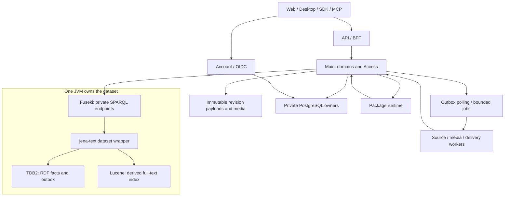

# Selected architecture

## Fast startup and product foundation

REZICS uses **Apache Jena Fuseki + TDB2 + jena-text/Lucene**. Start with one graph
service, one product dataset and a small authenticated vertical journey. The
[installation guide](../operations/installation.md) starts the graph substrate;
[the delivery sequence](../plan/README.md) adds actual REZICS commands and clients.
The checkout now includes the qualified graph substrate and a first internal Main
storage command; Account, Access admission and the product web client are pending.

Space (Realm and Zone), contextual classification/ratings and a maintained REZICS
Main Version remain the product foundation. Books, software, media, recipes,
Skills and Prompts exercise the same identities, provenance and content contracts.
The fast path changes delivery order, not their meanings or retained capabilities.

## System layers

| Layer | Selected responsibility |
| --- | --- |
| Meaning | RDF 1.1 resources, typed values, identified assertions, contexts and source mappings; JSON-LD 1.1 exchange. |
| Authority | Account authentication and private PostgreSQL Access state; Main admits commands and queries. |
| Product state | Main owns identity, adoption, publication, lifecycle and immutable component revisions. |
| Query | Fuseki serves ARQ SPARQL 1.1; jena-text supplies Lucene matches that join graph relations. |
| Storage | TDB2 stores current facts, revision anchors, receipts and outbox; immutable objects store revision payloads and media. |
| Execution | Main contains domain and Access modules; Account, package runtime and workers have explicit contracts. |

## Initial runtime choices

Main and Account use TypeScript, Elysia 2.0 and Bun; Account keeps Better Auth
behind OIDC. This is the maintainer-selected production target, including the
current Elysia 2 prerelease line, not a claim of completed runtime qualification.
Main uses reusable HTTP connections to Fuseki. The published OpenAPI description
serves external clients, and the first-party web uses an Eden client typed from
Main's exported app type. Consumers do not need a Java implementation. The graph
service is a JVM process; application processes never open its TDB2 directory.

Yarn owns the JavaScript/TypeScript workspaces and lockfile. Backend development
scripts and production entry points both execute Bun. The
[repository layout](../development/repository-structure.md) separates package
management from runtime selection. Rust remains available for a justified native
solver or worker, not the default Main implementation. The
[stack comparison](../research/application-stack.md) records current versions and
Hono/Elysia differences. The web target is React with vinext's Next.js-compatible
API on Vite, deployed to Cloudflare Workers; [frontend delivery](../plan/frontend.md)
owns its compatibility and experience acceptance.

The full Fuseki distribution supplies jena-text and a compatible Lucene version.
Pin the distribution, Java runtime, assembler and analyzer profile together.
Use the supplied engine before considering extensions. Every normal RDF write
uses the configured text dataset so indexed predicates participate in index
maintenance. Bulk loading and index recovery have separate offline procedures.
See [storage binding](../storage/jena.md) and [search](../contracts/search.md).

Start with one private PostgreSQL process, separate Account/Access ownership,
durable object storage and a polling outbox worker. Redis, a broker, a separate
search cluster, database replicas and a distributed scheduler are optional later
work. Main may host the first polling worker; durable checkpoints still apply.
SHACL validation runs inside the Fuseki JVM through the REZICS command module,
in the same TDB2 write transaction as the change; [validation](../implementation/model-profile-validation.md)
explains that boundary. Development and QA run PostgreSQL, Fuseki and object
storage in Docker Compose, as the [toolchain lock](../development/toolchain.md#local-services)
specifies.

## Consistency and retained revisions

One admitted graph command changes its aggregate, immutable revision anchor,
operation receipt and outbox in one TDB2 transaction. Its application fence is
`{datasetId, dataEpoch, sequence}`. A returned HTTP success or advanced sequence
alone does not prove that a conditional command matched; its own receipt does.
Several HTTP requests do not share a remote transaction.

TDB2 MVCC supports running transactions; it is not a permanent business history
API. Exact revisions resolve application-owned immutable component manifests and
payloads. Current projections can be replaced without changing those retained
states. A sealed release records exact transitive dependencies rather than a
whole-database copy. See [Main Version](../contracts/main-version.md).

PostgreSQL, objects, TDB2 and Lucene have distinct failure boundaries. Stage and
verify objects before graph activation, apply the Access admission/revocation
bridge, and rebuild Lucene from retained RDF after an uncertain index failure.
The first search lane indexes public text; protected text requires its scoped
admission and statistics-isolation qualification before activation. Current
restrictions also apply when reading historical revisions.

## Growth and deployment

Use one effective writer on one assessed principal host. A second host can run
API and unrelated workloads; it does not create automatic database availability.
TDB2 supports concurrent readers and one active writer per dataset; there is no
selected shared-directory replica or built-in distributed shard plan. Partition
by explicit ownership only after measured need, with separate datasets,
transactions and recovery epochs. [Deployment](../operations/deployment.md)
retains manual recovery and practical-host qualification.

Fresh installation and source-native conversion are required. Old schemas, IDs,
URLs, SDKs and migration-only dual writes need no compatibility layer. Any real
retained data still requires an inventoried export, validated conversion and
recovery plan before retirement; the docs do not authorize discarding it.
