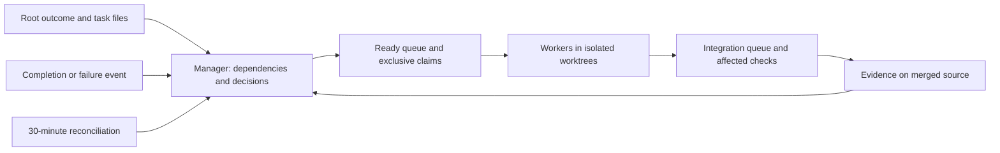

# Backend Goal orchestration

Status: activated 2026-09-26 03:57:20 UTC. The root [GOAL](../../GOAL.md) remains
the completion contract, and the [execution plan](../plan/README.md) is the sole
assignment and status authority. The retained scope is all 276 backend acceptance
cases across M01–M10; frontend implementation and browser acceptance are excluded.

## Management handover

The previous implementation task `01a0d1d3-22b4-7ba0-8e69-37de6d474faa`
was explicitly stopped with its workers interrupted. Its earlier predecessor
`01a0cf63-114d-7fb2-810e-0330a58b6675` was paused. Neither is a current
scheduler. At handover, `main` was clean at `f2c8aa1`; the last broad recorded
result was 11 passed, 35 partial and 231 uncovered among the historical 277
cases. The backend inventory retains 276 cases, with `VIEW04` excluded as
rendered-only. The current manager is Codex task
`01a0dbdb-af13-7a71-b5a1-936826c4d64a`, with a ten-hour target ending
2026-09-26 13:57:20 UTC. The historical broad result is not a fresh backend
percentage or acceptance run.

The manager owns dispatch and integration into `main`. The first ready briefs are
[G-001](tasks/G-001.md) and [G-002](tasks/G-002.md), each on an independent
worktree from the handover commit. Their paths and tests are disjoint. The
[retained operation map](../plan/backend-operations.md) assigns every backend
case to an owner API; uncertain later tasks remain coarse in the plan until
their dependencies and interfaces stabilize. The manager starts with two workers,
handles completion/blocker events immediately while active, and has a same-task
30-minute reconciliation schedule. The schedule requires the local app and
computer to remain running. Task handoffs are not verified completion: merged
source and recorded test evidence decide status.

The research and scheduling rationale below remains the basis for this active
program. Proposed scaling steps are not automatic authorization to exceed the
current two-worker limit.

## Decision proposed

Move sustained delivery to versioned task specifications, one scheduling
authority, isolated worker threads, and evidence-based completion. Let the
manager revise decomposition, dependency order, ownership, estimates and
concurrency. Keep the final product requirements stable while those plans change.

Use task completion and failure events for dispatch. Use a 30-minute checkpoint
for reconciliation, bottleneck correction and a revised completion forecast.
Thirty minutes is a proposed local management interval, not a measured optimum.

Separate management from routine implementation and conflict repair. A manager
that writes every shared change and repairs every merge becomes a serial
dependency. Integration still needs one authoritative queue, but its ordinary
checks and repairs can be executed by the harness and explicitly assigned owners.

## What the primary evidence establishes

| Evidence | Observation | What transfers to this project |
| --- | --- | --- |
| [OpenAI Symphony](https://openai.com/index/open-source-codex-orchestration-symphony/), 2026-04-27; [service specification](https://github.com/openai/symphony/blob/main/SPEC.md) | A tracker-backed scheduler runs isolated issue workspaces with bounded concurrency, reconciliation and retries. Repository-owned workflow instructions describe execution policy. The reference implementation is an engineering preview. | The proposed manager/task/workspace architecture has a concrete precedent. Its current tracker integration does not establish that this repository's Markdown files are a supported queue without an adapter. |
| [Cursor's initial scaling experiment](https://cursor.com/blog/scaling-agents), 2026-01-14 | Flat coordination and a shared locked task file bottlenecked workers. Hierarchical planning helped; a dedicated integrator also became a bottleneck. Large generated projects still needed review. | Explicit decomposition and ownership matter. Central authority must not turn every change into manual work for one agent. |
| [Cursor's revised swarm](https://cursor.com/blog/agent-swarm-model-economics), 2026-07-20 | With matching models and elapsed budgets, a revised harness reached 73–85% of a held-out SQL suite after four hours versus 11–77% for the old harness. It combined decision ownership, shared design records, conflict resolution and other interventions. | Harness design can materially improve results. The comparison does not isolate concurrency, does not supply a controlled solo baseline, and does not qualify all database properties. Adopt the coordination principles, not its custom version-control project. |
| [Anthropic multiagent experiments](https://www.anthropic.com/research/multiagent-systems), 2026-08-13 | In twelve-hour game-building experiments, teams from ten to eighty agents encountered coordination and integration problems. CEO-style prompts alone did not resolve the poor product outcomes. | Adding a manager persona and more workers is insufficient for dependent engineering. Evaluate complete behavior after integration. |
| [MSEval](https://arxiv.org/html/2607.27877v1), 2026-07-30 | Ten coding projects and ten collaboration modes yielded no universally best topology. The runtime combined periodic synchronization with active messages. Web-app concentration and limited repeated trials constrain generalization. | Select ownership and handoffs for the actual dependency graph; measure elapsed time, quality and total cost together. This is design evidence, not a REZICS completion forecast. |
| [Scaling agent systems, revised paper](https://arxiv.org/html/2512.08296v3), 2026-04-08 | The revised study contains 260 configurations and six benchmarks. Its small SWE-bench subset did not establish a coding advantage for multiple agents; uncertainty is substantial. | Benchmark accuracy changes must not be presented as project speedups. Do not extrapolate small teams or older models to a hundred-worker delivery guarantee. |

There is also evidence against permanent process accumulation:
[Anthropic's long-running harness report](https://www.anthropic.com/engineering/harness-design-long-running-apps)
removed scaffolding as model capability improved. A more elaborate harness could
deliver a richer result while taking longer and costing more. Add a coordination
mechanism to resolve an observed failure, then reassess its cost.

The recommendation below is an engineering proposal derived from these sources
and the repository's current boundaries. It has not been benchmarked here.

## Responsibilities and state



The manager owns the plan and cross-domain decisions. Workers implement complete
behavior bundles, including their required tests, and return concise evidence.
A named integration owner or executor performs merges and affected checks;
conflict repairs go to a bounded repair assignment. Independent review is used
for consequential authority, concurrency and recovery claims. It does not become
a committee reviewing every small edit.

Proposed durable files after handover:

```text
GOAL.md                          retained outcome and final acceptance
docs/goals/README.md              scheduling policy and program entry point
docs/goals/tasks/G-*.md           bounded task specifications and handoffs
docs/plan/README.md               links to the active program and past batches
.temp/goal-orchestration/         local runtime mappings, leases and logs
```

Keep product decisions in their existing contract owners and link to them from
tasks. Do not copy the architecture or global acceptance matrix into every brief.
Before activation, reconcile the execution workflow and plan so there is exactly
one assignment/status authority. Completed batch history remains available.

Runtime records map a stable task ID and revision to its thread ID, worktree,
attempt, base commit, last observed state and claim owner. Only one scheduler
writes those records. A restart first reconciles known threads and worktrees;
it must not blindly relaunch every task marked running. Claim expiry alone is
insufficient to replace a worker that may still be writing: establish termination
or isolate the abandoned attempt before reassignment.

Task states distinguish `planned`, `ready`, `running`, `review`, `integrated`,
`verified`, `blocked` and `cancelled`. A worker's final message is a handoff, not
proof of completion. Verification records the tested merged commit and exact
assertions; relevant later changes can invalidate it. Root completion still
requires the final recorded backend acceptance on the final source.

## Task size and ownership

Use a complete API/owner behavior as the normal unit: schema and constraints,
state transitions, authorization, idempotency/concurrency behavior, API wiring,
and applicable recovery/complexity tests. An initial sizing target is roughly
45–90 minutes to an integrated result. This is a calibration hypothesis, not a
deadline that permits partial acceptance. Small dependent repairs stay with
their owner; do not create a new thread for each function or test.

Each task needs:

- Stable ID, parent outcome, goal revision and status.
- Concrete deliverable and affected acceptance IDs, with the exact assertions
  this task can close. A partial contribution must be identified as partial.
- Dependencies, required interface versions and the qualified base commit.
- Owned paths and shared files requiring an integration change.
- Links to contract/schema decisions and explicit unresolved design questions.
- Required documented root checks and the expected handoff artifact.
- Thread/worktree mapping, elapsed estimate, blocker and next action.
- Result commit, checks actually run, evidence location and remaining limitations.

Create task files only as their inputs become sufficiently clear. Map every
retained acceptance case to an accountable owner, but keep uncertain downstream
work as coarse backlog until its interfaces stabilize. Counting task files is not
a progress metric.

In the current repository, `app.ts`, OAuth scopes, generated registries,
Content migration ordering, recovery manifests and QA coverage declarations are
shared boundaries. Assign each a decision owner. Workers author domain modules,
migration bodies and tests separately; the integration queue sequences shared
registration and migration numbers. Where a large shared file causes repeated
collisions, make the smallest useful module extraction. Worktree isolation alone
does not resolve semantic conflicts or isolate databases, ports and fixtures.

The first independent candidates from the earlier audit were authorization
lifecycle and structure-occurrence behavior; package/source work contains the
currently active changes. Recheck the handover commit before assigning any of
these. A changing checkout is not a frozen task baseline.

## What the manager may change

The manager may split or combine child tasks, revise implementation plans,
reassign ownership, change sequencing and estimates, adjust concurrency, and
create a repair task when new evidence warrants it. Changes record a revision
and reason; affected workers receive the changed contract at a safe checkpoint.

The manager preserves the root outcome and retained acceptance requirements.
Splitting a task does not delete unmet assertions. Lowering required quality or
removing product scope is a change to the user's requested outcome, not routine
scheduling. Revised child completion criteria must still cover their assigned
root requirements. This preserves useful autonomy without allowing a manager to
improve the progress percentage by redefining completion.

## Scheduling and scaling

1. Dispatch a task only when its dependencies and ownership are ready. Prefer
   work on the longest remaining dependency chain, then independent work that
   keeps capacity productive.
2. Handle completion, failure and interface conflicts promptly while the manager
   is active. The 30-minute checkpoint reconciles state, detects missing events,
   updates forecasts and reallocates work. It does not force healthy workers to
   restart or wait for the next tick.
3. Start the first delivery batch with two workers under the current
   [delegation policy](../plan/execution-workflow.md#delegation-and-worker-lifecycle).
   Expand toward four, eight or more standalone threads only when enough
   independent tasks, runner capacity and integration throughput exist. These
   counts are trial steps, not a prescribed final team size.
4. Compare accepted behavior per wall-clock hour, including setup, manager work,
   reviews, integration and repairs. Also record total worker/manager token cost,
   first-pass acceptance, dependency wait, oldest integration item and remaining
   critical path. Different tasks give an operational signal, not a controlled
   causal estimate of speedup.
5. Expand after a complete batch demonstrates useful throughput at acceptable
   cost without a growing repair queue. Reduce concurrency or repair ownership
   boundaries when merge waits and rework consume the gain. Log the reason in
   the existing program status; do not build a separate telemetry platform.

The four subagent slots exposed in this research conversation are a local tool
limit. They do not establish a global limit on standalone application threads.
Actual account/provider throughput, host memory, test resources and application
concurrency still require measurement. Extra open threads may share the same
limiting resource.

At each checkpoint, publish: newly verified behavior, remaining blockers and
their owners, capacity/queue pressure, the critical-path forecast, and the next
assignment changes. A lack of commits is a prompt to inspect evidence, not an
automatic reason to kill a worker performing valid long-running work.

## Fit to the currently available tools

The current app tools can create isolated project threads, read their results,
send concrete follow-ups and wait for completion. A same-thread scheduled
follow-up can resume the manager for its periodic checkpoint. Local scheduled
work requires the computer and app to remain running; see
[scheduled task documentation](https://learn.chatgpt.com/docs/automations).

While the manager is active, completion waits can drive immediate dispatch.
A timer alone does not guarantee immediate event-driven wake-up while the manager
is inactive. The implementation must test these two paths separately.

The exposed tool inventory does not currently provide a verified general
stop/cancel operation for another standalone thread. Subagent interruption does
not prove standalone-thread interruption. The pilot must establish cooperative
stop acknowledgement or use a runner with supported cancellation before
automatic replacement is enabled. Do not misuse thread handoff as cancellation.
Also verify single-manager execution and duplicate-dispatch prevention rather
than assuming a scheduled prompt supplies those guarantees.

Use existing app capabilities for the first deployment. Symphony supplies a
useful scheduler specification; installing its reference service, adding a
Markdown tracker adapter or introducing a runtime must first fit the
[adopted toolchain](../development/toolchain.md). A new general-purpose
orchestration framework is not a prerequisite for a ten-hour delivery attempt.

## Ten-hour delivery attempt

Ten hours is the requested wall-clock target. The remaining useful work and its
dependency graph have not yet been measured well enough to promise that result.
The earlier 100–300-hour estimate was uncalibrated and must not be used as input.

For an unchanged workload W and N equally productive workers, an ideal lower
bound is `max(W / N, longest dependency chain)`, before coordination and rework.
Thus the hypothetical 1,000 worker-hours in ten hours requires at least 100 fully
productive worker equivalents and a sufficiently short dependency chain.
At 100 workers, even a 1% strictly serial share gives
`1000 * (0.01 + 0.99 / 100) = 19.9 hours` in the simple Amdahl model.
These are illustrative bounds, not estimates for REZICS. Better decomposition,
context isolation, native-tool reuse and fewer redundant checks can also reduce
the workload itself; that benefit needs to be measured.

| Time from handover | Deliverable and decision |
| --- | --- |
| 0:00–0:30 | Preserve the current work and qualified baseline, reconcile program authority, identify shared decisions, map remaining acceptance ownership, and prepare the first ready tasks. The user pauses the old Goal before a new manager becomes the writer. |
| 0:30–1:30 | Deliver two representative complete bundles with isolated workers; test handoff, manager reconciliation and duplicate-dispatch prevention. Build only the minimum scheduling records needed. |
| 1:30–2:00 | Measure merged, passing output and remaining dependency chains. Expand concurrency if the trial supports it and resources permit. Publish the first defensible forecast and name any chain that exceeds the available time. |
| 2:00–7:30 | Dispatch ready work continuously; perform the 30-minute forecast/replanning checkpoints. Reuse qualified dependencies and prepared fixtures. Workers return concrete repair work to its owner. |
| 7:30–8:00 | Complete integration and close the repair queue. A substantial unimplemented capability at this gate makes the ten-hour full-scope forecast untenable and must be reported immediately. |
| 8:00–10:00 | Reserve a provisional two-hour window for clean construction and final backend recording, including repairs. Run `yarn qa --backend --record` on the final clean source. This reserve must be checked against measured setup/QA duration. |

Normal batches retain affected backend checks through documented root commands.
The existing schema-first, bulk-data-once and isolated-restore policy remains in
force; routine data preparation has a 600-second budget. Final acceptance retains
all required real boundaries, recovery, fresh construction and load evidence.
Filling coverage declarations without those assertions is not completion.

## Initial adoption checks

The handover above names the manager and checkpoint; the execution plan names
the active scope and assignments. The first implementation must demonstrate one
task from ready through merged verification, a blocked-task reassignment, and
recovery without duplicate writers. Scale only after those mechanisms and useful
delivery throughput are observed. The ten-hour target is not yet a measured
completion forecast.
