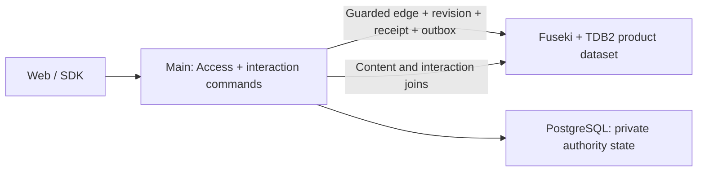

# Interaction graph and cache bootstrap

Start with Main owning likes and favorites in the Jena product dataset. Keep
Access inside Main's process behind its own interface, with private authority
state in PostgreSQL.
Redis is outside the first release's delivery and acceptance scope. Its deployment,
client integration, cache consumers and Redis-specific tests are later optimization
work. The first release completes the Jena interaction path without that dependency.
Do not add a second authoritative interaction database merely because the data changes often.

This is the recommended bootstrap design, supported by the native transaction
mechanism and application protocol below; Jena runtime qualification remains
pending. It is not a production capacity result. The existing
[command](../contracts/commands.md), [vote/reference](../contracts/votes-and-references.md)
and [disclosure](authorization-bridge.md) contracts continue to apply.

## Graph meaning versus physical storage

A like is a graph relationship between an actor and an exact target in a context.
That logical relationship can be persisted by a relational, key/value or native
graph engine. A Redis count or list is another physical read representation, not
another owner of whether the like exists.

Facebook's TAO paper describes likes as associations and MySQL as the persistent
backing store behind a graph API/cache. It does not imply a compulsory pipeline
from a standalone likes database into a second graph database. REZICS already
selects Jena as its graph store, so persisting the interaction there is the
shortest path to joint content/interaction queries.
[TAO, USENIX ATC 2013, sections 3–5](https://www.usenix.org/system/files/conference/atc13/atc13-bronson.pdf).

LinkedIn's LIquid is another documented graph system with a different physical
design and Datalog queries. Its lesson here is to preserve useful joins, not to
infer that LinkedIn's likes use this exact storage path or that all companies use
one architecture. [LIquid engineering account, 2020](https://www.linkedin.com/blog/engineering/graph-systems/liquid-the-soul-of-a-new-graph-database-part-1).



The diagram shows the first-release path. Durable outbox requirements remain for
committed business effects; Redis-specific consumers are deferred. An outbox relay
for activated effects may run as a bounded Main background task. Independent workers
can use the existing JetStream direction when activated; a broker is not required
just to make a local like durable. Fuseki remains a separate engine service. In-process Access does not eliminate its database I/O or turn Jena and
PostgreSQL into one transaction.

## Jena mechanism and application protocol

TDB2 supplies transactional RDF reads/writes; its documented model permits one
active writer with concurrent read transactions. The single Fuseki JVM owns its
files. Main uses SPARQL Query and Update over HTTP; another embedded TDB2 opener
is not an interaction worker. [TDB transactions](https://jena.apache.org/documentation/tdb/tdb_transactions.html)
explain that boundary, not the complete REZICS command protocol.

[Jena storage](../storage/jena.md) owns conditional SPARQL mutation, immutable
RevisionAnchor manifests, application sequence allocation, receipts and durable
outbox records. Jena does not supply Fluree history, commit IDs, minimum-transaction
headers or a business change feed. Every domain write must use the guarded Main
adapter; arbitrary internal update access would bypass these invariants. Read the
operation receipt to distinguish a successful mutation from a successful HTTP
request whose WHERE guard matched no rows.

The historical eleven-assertion Fluree probe is retained only in
[retired engine evidence](../research/retired-interaction-engine-evidence.md).
It establishes no Jena or end-to-end interaction acceptance.

## Store a small interaction, not a changing resource document

Use an identified `Interaction` record. Conceptually:

```text
Interaction
  id             native UUIDv7 / canonical IRI
  key            canonical unique interaction slot
  actor          admitted actor/counting handle
  kind           like | favorite | follow
  target         exact Resource/Revision/Occurrence reference required by the feature
  context        explicit Realm/population/context reference
  container      optional favorite collection, if the feature requires one
  active         true | false
  revision       monotonically increasing edge revision
  activatedAt    feature-defined list ordering time
```

The canonical key covers the feature's counting identity, target grain, context
and interaction slot, plus container where appropriate. A change of public persona
does not produce another ballot for a feature that counts one person. The key is
not a client-controlled identity and must not expose Account IDs. A stable UUIDv7
record and a private canonical key are separate concerns.

This record is itself part of the graph:

```text
Actor A <- actor - Interaction I - target -> Work W - classifiedAs -> Concept C
                           |
                    kind=like, active=true, context=Realm R
```

Likes and simple favorites have different slots. An ordered collection with repeat
placements uses the existing occurrence model rather than inheriting favorite
uniqueness. Retain a withdrawn record/revision through the replay horizon to prevent
old requests resurrecting it. Privacy erasure remains a separate procedure: graph
retraction does not by itself erase retained history.

Initially use one small product dataset so content joins and relevant
local transactions stay simple. Put sensitive predicates/graphs behind the actual
qualified disclosure profile; a graph name alone is not authorization. Do not put
private counting handles into public graph exports. Avoid a dataset per actor,
resource or Realm.

## Write and read paths

The server exposes desired state, not an ambiguous toggle:
`set_like(target, context, active, expected_revision, operation_key)`.

1. Main authenticates and obtains an Access admission for that actor, target and
   operation. Current target lifecycle/disclosure remains part of the command.
2. Conditional create looks up the canonical slot in the transaction and creates
   it only if absent. A change pins the existing interaction and expected revision.
   Use the single effective HTTP writer and guarded transaction path; a check in
   application code followed by an unconditional insert is insufficient.
3. Commit the edge transition, immutable revision reference, operation receipt,
   minimal outbox event and incremented application dataset sequence in the
   **same guarded TDB2 transaction**. Guard all state/model/shape/placement/epoch
   dependencies and receipt absence. An already desired state creates no second
   business transition; a new operation still records its no-change outcome under
   the storage protocol. Duplicate keys replay the original receipt; a different
   request digest conflicts.
4. Return the committed actor state, edge revision and application fence
   `{datasetId, dataEpoch, sequence}`.
   On an unknown network outcome, read the operation receipt before retrying.
   A stale CAS or a mere successful HTTP transport status is not a new like.

One user's like changes that interaction's facts. It does not rewrite a work's
Main Version, a whole list of likers or a synchronous shared popularity counter.
Every durable click still costs a guarded transaction/revision/outbox change.
Coalesce high-frequency progress updates under their own loss/flush contract; do not silently
drop acknowledged like/favorite changes to reduce writes.

Implement these read operations first:

- Own state for a page: one bounded query over actor, context and target IDs.
- Favorites: anchor on actor/container, join active favorite edges to content,
  apply content filters, then stable ordering. Keyset pages need a declared
  changing-view contract or a materialized bounded result; an application fence cannot retain the same TDB2
  snapshot across independent HTTP requests.
- Public totals: count active eligible edges for requested targets/populations;
  start with bounded direct queries. Cached snapshots are an optimization, not a
  required first-release deliverable.
- Graph discovery: combine the interaction relation with classification/content
  in the same admitted graph query. Display enrichment may happen after paging;
  membership filters and ranking cannot be faked by filtering only a cached page.

There is no mandatory content/interaction cross-store join in these initial
operations. An exact count over a very popular target may still be expensive: a count is not constant
work merely because it returns one number. Deadline/budget exhaustion must remain
explicit rather than returning a truncated count as exact.

## Cache evolution beyond the first-release baseline

This roadmap preserves later options. It does not add Redis to the first-release
implementation checklist, deployment topology or acceptance gates. In-process
optimizations may be used if needed, but a cache subsystem is not a separate
required deliverable. The first release keeps clear data-access boundaries without
requiring unused Redis adapters or a cache framework.

| Step | Add | Keep authoritative |
| --- | --- | --- |
| 0: first-release baseline | Jena writes/reads; batched queries; explicit interaction data-access boundaries. | Edge state, receipts and outbox in Jena. |
| 1: repeated hot reads | Bounded in-process cache for count snapshots, with per-key request coalescing. An initial configurable 2-second count freshness budget is a proposal, not a measurement. | Own-state and complete favorites queries can continue reading Jena. |
| 2: later release, shared hot reads | Add Redis when measurements justify it. Cache count snapshots and justified bounded result pages; continue write-to-Jena first. | Redis loss never loses a confirmed like or favorite. |
| 3: measured aggregate cost | Coalesce dirty targets and recompute snapshots; consider incremental materialization only when recomputation demonstrably misses its budget. | A replayable Jena source and a documented projection version/fence. |

A cache key includes feature/schema version, target or actor scope, context,
population/disclosure domain and query/page selection as applicable. Values carry
source position, observation time and completeness. Public totals and a person's
current favorite state have different freshness and privacy contracts.

For shared semantic [Contexts](../contracts/context.md), distinguish applied
definition/semantic-selection revisions from preference ordering and the feature's
acceptance/population scope. A shared Context does not merge voter identities or
public/private caches. A preference-only edit can invalidate ordered pages without
rewriting authored statement meaning; a semantic successor does not advance pinned
consumers. Hidden definition or personal-selection dependencies cannot leak through
cached counts, names, avatars or fallback.

Start Redis with snapshot replacement, not per-request `INCR`/`DECR`. Coalesced
invalidation plus lazy refresh is easier to rebuild and handles duplicate events
without corrupting totals. Redis sorted sets can later serve versioned hot lists
or ranking projections; they do not replace the canonical favorite relation or
guarantee that an arbitrary filtered top-N query is complete.
[Sorted-set capability](https://redis.io/docs/latest/develop/data-types/sorted-sets/).

### Cache consistency and failure

For low-risk count snapshots, enforce the declared maximum age from source snapshot
acquisition, not from completion of a delayed read. Expired entries are refreshed
under a per-key lease/single-flight mechanism; cap concurrent misses and use jitter
to avoid a cache restart overwhelming Jena. Own-state reads following a mutation
carry its minimum fence or bypass the cache.

An old cache fill must not overwrite an invalidated/newer value. Grant a fresh
opaque fill token, invalidate that token on change, and install only while the
same unexpired token remains. If token metadata is evicted or lost, reject the old
fill and acquire a new token. Snapshot positions provide an additional ordering
check. This protects observed invalidations; delayed or missing invalidations still
need the freshness bound and replay recovery. A Lua script can implement the small
atomic check/install inside Redis, but does not make Redis and Jena one transaction.
[Redis scripting](https://redis.io/docs/latest/develop/programmability/eval-intro/).

These rules follow specific evidence: the NSDI 2013 Memcache paper uses leases for
stale fills and request herds; Meta's 2022 engineering account shows how eviction
can erase version knowledge and let an older reply win. Neither proves our cache
implementation. [Scaling Memcache, section 3.2.1](https://www.usenix.org/system/files/conference/nsdi13/nsdi13-final170_update.pdf),
[Cache made consistent](https://engineering.fb.com/2022/06/08/core-infra/cache-made-consistent/).

The relay polls committed outbox records in the product dataset ordered by
`(dataEpoch, sequence, eventId)`, binding pages to a captured application sequence
and checkpointing only after effects/durable handoff. Allocation of the sequence
and outbox insertion are in the same guarded transaction, so a preallocated event
ID or wall-clock timestamp is not mistaken for commit order. Duplicate delivery
is expected; consumers use source/event identity and operation revisions.

Jena supplies no application commit-history/SSE recovery feed. Redis Pub/Sub can
later wake cache listeners, but it is not the durable source. Its at-most-once
[delivery semantics](https://redis.io/docs/latest/develop/pubsub/) require replay
from retained outbox state. A lost checkpoint/retention boundary or changed dataset
epoch requires reconciliation or a fresh snapshot, not a silently advanced cursor.

If later using incremental counts, persist/atomically update each edge's applied
revision and state with its contribution, or preserve an equivalent ordered
checkpoint protocol. On Redis flush, build a new generation from a Jena snapshot
and replay after its fence before serving it as complete. Evicted dedupe keys plus
blind replayed increments are not a correct counter. Security withdrawal/erasure
uses current disclosure and its fence, never the count cache's TTL as authorization.

## When another interaction database is justified

Redis reduces repeated read/aggregate work. It cannot increase the per-dataset
durable commit service rate or remove history/index write cost. First measure
transaction queueing, commit latency, projection/index lag, CPU, memory and storage
under mixed content and interaction traffic.

If reads are the bottleneck, improve anchored queries, coalescing/cache and admitted
read plans. If writes are the bottleneck, assess separate interaction datasets and placement/batching with per-operation receipts. These change query and
snapshot boundaries and require qualification. Use a separate SQL/KV interaction
authority only when the measured workload and required query semantics justify
that cost; then define one writer, an outbox and graph projection freshness rather
than synchronously writing two authoritative copies.

TAO is evidence for such a specialized graph-serving layer at scale, not evidence
that REZICS must build it before its first working product. We have no measurement
establishing which later write-store alternative wins on the available hosts.

## Jena implementation and launch gates

First implement the authenticated interaction slice after the graph substrate:

1. Account/Main/Fuseki/TDB2/PostgreSQL topology, Main-hosted Access and generated
   interaction contracts. Add desired-state likes/favorites with private disclosure,
   complete mutation guards, immutable revisions and operation receipts/outbox.
2. Add bounded own-state, favorites/content and count reads with application data
   fences. Exercise concurrent edits, duplicate keys/digest conflicts, target
   deletion, revoked access, lost responses, process crash and restart. Add UI
   states against these APIs when runtime implementation is authorized.
3. Measure a documented small mixed workload, including hot targets and rapid
   unlike/re-like. Suggested experimental levels are 10/100/1000 attempted
   mutations per second, stopping at saturation; these are not promised capacity.
   Record achieved committed rate and latency tails on durable storage. Agree
   actual latency/freshness budgets before qualifying the product.

The public graph/text quickstart only proves its selected substrate smoke path.
It is not acceptance of this authenticated slice or every retained product feature.
A later Redis scope must separately verify stale fills, duplicate/missing events,
eviction, flush/restart, fallback budgets, replay and current disclosure. Those
conditions do not add Redis to the first release. The [program plan](../plan/README.md)
owns delivery status; historical experiments do not advance its Jena runtime gates.
