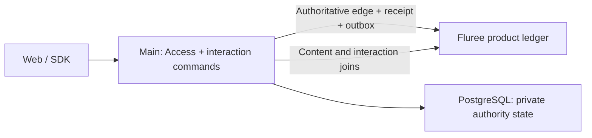

# Interaction graph and cache bootstrap

Start with Main owning likes and favorites directly in Fluree. Keep Access inside
Main's process behind its own interface, with private authority state in PostgreSQL.
Redis is outside the first release's delivery and acceptance scope. Its deployment,
client integration, cache consumers and Redis-specific tests are later optimization
work. The first release completes the Fluree interaction path without that dependency.
Do not add a second authoritative interaction database merely because the data changes often.

This is the recommended bootstrap design, supported by the mechanism review and
bounded experiment below. It is not a production capacity result. The existing
[command](../contracts/commands.md), [vote/reference](../contracts/votes-and-references.md)
and [disclosure](authorization-bridge.md) contracts continue to apply.

## Graph meaning versus physical storage

A like is a graph relationship between an actor and an exact target in a context.
That logical relationship can be persisted by a relational, key/value or native
graph engine. A Redis count or list is another physical read representation, not
another owner of whether the like exists.

Facebook's TAO paper describes likes as associations and MySQL as the persistent
backing store behind a graph API/cache. It does not imply a compulsory pipeline
from a standalone likes database into a second graph database. REZICS already
selects Fluree as its graph store, so persisting the interaction there is the
shortest path to joint content/interaction queries.
[TAO, USENIX ATC 2013, sections 3–5](https://www.usenix.org/system/files/conference/atc13/atc13-bronson.pdf).

LinkedIn's LIquid is another documented graph system with a different physical
design and Datalog queries. Its lesson here is to preserve useful joins, not to
infer that LinkedIn's likes use this exact storage path or that all companies use
one architecture. [LIquid engineering account, 2020](https://www.linkedin.com/blog/engineering/graph-systems/liquid-the-soul-of-a-new-graph-database-part-1).



The diagram shows the first-release path. Durable outbox requirements remain for
committed business effects; Redis-specific consumers are deferred. An outbox relay
for activated effects may run as a bounded Main background task. Independent workers
can use the existing JetStream direction when activated; a broker is not required
just to make a local like durable. Fluree is still a separate selected engine
service. In-process Access does not eliminate its database I/O or turn Fluree and
PostgreSQL into one transaction.

## Fluree mechanisms checked

The reviewed release is **v4.2.1**, tag commit
`82dbcec3e435d6ed1d45bc0ed929432323b6b201` (released 2026-09-18).

| Requirement | Evidence and limitation |
| --- | --- |
| Create once, change, withdraw | JSON-LD WHERE/DELETE/INSERT supports conditional creation and compare-and-swap. Zero matching rows make the whole update a no-op, including literal INSERT templates. [Conditional updates](https://raw.githubusercontent.com/fluree/db/v4.2.1/docs/transactions/conditional-updates.md), [upstream tests](https://github.com/fluree/db/blob/82dbcec3e435d6ed1d45bc0ed929432323b6b201/fluree-db-api/tests/it_transact_conditional.rs). |
| Concurrent writes | The HTTP path serializes writes per ledger. Different ledger writes may proceed in parallel. This supports one effective writer's guarded creation but also defines a throughput boundary; more Main replicas do not remove it. [HTTP transaction contract](https://raw.githubusercontent.com/fluree/db/v4.2.1/docs/api/endpoints.md). |
| Joined reads and counts | Native queries can join interaction subjects to content and apply filtering, grouping, ordering and limits. Anchored queries and bounded work remain necessary. [JSON-LD query interface](https://raw.githubusercontent.com/fluree/db/v4.2.1/docs/query/jsonld-query.md). |
| Read after a write | The HTTP `Fluree-Min-T` header can require observation of a minimum transaction position. Keep the ledger/branch with that position; it is not a global ordering across stores. [Query contract](https://raw.githubusercontent.com/fluree/db/v4.2.1/docs/api/endpoints.md). |
| Background indexes | Commits enter novelty before incremental indexing; queries merge indexed data with that overlay. High churn can increase query work and trigger indexing backpressure. [Performance design](https://raw.githubusercontent.com/fluree/db/v4.2.1/docs/design/performance.md). |
| Cache event recovery | SSE publishes nameservice changes and may skip broadcasts when a receiver lags. It is a wakeup hint, not a complete business change log. [Event handler](https://github.com/fluree/db/blob/82dbcec3e435d6ed1d45bc0ed929432323b6b201/fluree-db-server/src/routes/events.rs). |

Source examples need interpretation: the conditional-update guide's comparison
with an earlier ledger `t` cannot identify our successful operation if an unrelated
write intervenes. Check our guarded operation receipt. Similarly, ledger-qualified
positions remain essential despite broad wording in some receipt documentation.

## Store a small interaction, not a changing resource document

Use an identified `Interaction` record. Conceptually:

```text
Interaction
  id             native UUIDv7 / canonical IRI
  key            canonical unique interaction slot
  actor          admitted actor/counting handle
  kind           like | favorite | follow
  target         exact Resource/Revision/Occurrence reference required by the feature
  context        explicit Realm/population/context reference
  container      optional favorite collection, if the feature requires one
  active         true | false
  revision       monotonically increasing edge revision
  activatedAt    feature-defined list ordering time
```

The canonical key covers the feature's counting identity, target grain, context
and interaction slot, plus container where appropriate. A change of public persona
does not produce another ballot for a feature that counts one person. The key is
not a client-controlled identity and must not expose Account IDs. A stable UUIDv7
record and a private canonical key are separate concerns.

This record is itself part of the graph:

```text
Actor A <- actor - Interaction I - target -> Work W - classifiedAs -> Concept C
                           |
                    kind=like, active=true, context=Realm R
```

Likes and simple favorites have different slots. An ordered collection with repeat
placements uses the existing occurrence model rather than inheriting favorite
uniqueness. Retain a withdrawn record/revision through the replay horizon to prevent
old requests resurrecting it. Privacy erasure remains a separate procedure: graph
retraction does not by itself erase retained history.

Initially use the existing small product ledger so content joins and relevant
local transactions stay simple. Put sensitive predicates/graphs behind the actual
qualified disclosure profile; a graph name alone is not authorization. Do not put
private counting handles into public graph exports. Avoid a ledger per actor,
resource or Realm.

## Write and read paths

The server exposes desired state, not an ambiguous toggle:
`set_like(target, context, active, expected_revision, operation_key)`.

1. Main authenticates and obtains an Access admission for that actor, target and
   operation. Current target lifecycle/disclosure remains part of the command.
2. Conditional create looks up the canonical slot in the transaction and creates
   it only if absent. A change pins the existing interaction and expected revision.
   Use the single effective HTTP writer and guarded transaction path; a check in
   application code followed by an unconditional insert is insufficient.
3. Commit the edge transition, business receipt and minimal outbox event in the
   **same Fluree transaction**. The guard covers all three. Existing state with the
   desired value is a no-op; duplicate operation keys replay the original receipt,
   and a reused key with a different request digest conflicts.
4. Return the committed actor state, edge revision and ledger-specific source fence.
   On an unknown network outcome, read the operation receipt before retrying.
   A stale CAS or a mere successful HTTP transport status is not a new like.

One user's like changes that interaction's facts. It does not rewrite a work's
Main Version, a whole list of likers or a synchronous shared popularity counter.
Every durable click still costs a transaction/index/history change. Coalesce
high-frequency progress updates under their own loss/flush contract; do not silently
drop acknowledged like/favorite changes to reduce writes.

Implement these read operations first:

- Own state for a page: one bounded query over actor, context and target IDs.
- Favorites: anchor on actor/container, join active favorite edges to content,
  apply content filters, then stable ordering and keyset pagination.
- Public totals: count active eligible edges for requested targets/populations;
  start with bounded direct queries. Cached snapshots are an optimization, not a
  required first-release deliverable.
- Graph discovery: combine the interaction relation with classification/content
  in the same admitted graph query. Display enrichment may happen after paging;
  membership filters and ranking cannot be faked by filtering only a cached page.

There is no mandatory Fluree-to-SQL join in these initial operations. An exact
count over a very popular target may still be expensive: a count is not constant
work merely because it returns one number. Deadline/budget exhaustion must remain
explicit rather than returning a truncated count as exact.

## Cache evolution beyond the first-release baseline

This roadmap preserves later options. It does not add Redis to the first-release
implementation checklist, deployment topology or acceptance gates. In-process
optimizations may be used if needed, but a cache subsystem is not a separate
required deliverable. The first release keeps clear data-access boundaries without
requiring unused Redis adapters or a cache framework.

| Step | Add | Keep authoritative |
| --- | --- | --- |
| 0: first-release baseline | Fluree writes/reads; batched queries; explicit interaction data-access boundaries. | Edge state, receipts and outbox in Fluree. |
| 1: repeated hot reads | Bounded in-process cache for count snapshots, with per-key request coalescing. An initial configurable 2-second count freshness budget is a proposal, not a measurement. | Own-state and complete favorites queries can continue reading Fluree. |
| 2: later release, shared hot reads | Add Redis when measurements justify it. Cache count snapshots and justified bounded result pages; continue write-to-Fluree first. | Redis loss never loses a confirmed like or favorite. |
| 3: measured aggregate cost | Coalesce dirty targets and recompute snapshots; consider incremental materialization only when recomputation demonstrably misses its budget. | A replayable Fluree source and a documented projection version/fence. |

A cache key includes feature/schema version, target or actor scope, context,
population/disclosure domain and query/page selection as applicable. Values carry
source position, observation time and completeness. Public totals and a person's
current favorite state have different freshness and privacy contracts.

Start Redis with snapshot replacement, not per-request `INCR`/`DECR`. Coalesced
invalidation plus lazy refresh is easier to rebuild and handles duplicate events
without corrupting totals. Redis sorted sets can later serve versioned hot lists
or ranking projections; they do not replace the canonical favorite relation or
guarantee that an arbitrary filtered top-N query is complete.
[Sorted-set capability](https://redis.io/docs/latest/develop/data-types/sorted-sets/).

### Cache consistency and failure

For low-risk count snapshots, enforce the declared maximum age from source snapshot
acquisition, not from completion of a delayed read. Expired entries are refreshed
under a per-key lease/single-flight mechanism; cap concurrent misses and use jitter
to avoid a cache restart overwhelming Fluree. Own-state reads following a mutation
carry its minimum fence or bypass the cache.

An old cache fill must not overwrite an invalidated/newer value. Grant a fresh
opaque fill token, invalidate that token on change, and install only while the
same unexpired token remains. If token metadata is evicted or lost, reject the old
fill and acquire a new token. Snapshot positions provide an additional ordering
check. This protects observed invalidations; delayed or missing invalidations still
need the freshness bound and replay recovery. A Lua script can implement the small
atomic check/install inside Redis, but does not make Redis and Fluree one transaction.
[Redis scripting](https://redis.io/docs/latest/develop/programmability/eval-intro/).

These rules follow specific evidence: the NSDI 2013 Memcache paper uses leases for
stale fills and request herds; Meta's 2022 engineering account shows how eviction
can erase version knowledge and let an older reply win. Neither proves our cache
implementation. [Scaling Memcache, section 3.2.1](https://www.usenix.org/system/files/conference/nsdi13/nsdi13-final170_update.pdf),
[Cache made consistent](https://engineering.fb.com/2022/06/08/core-infra/cache-made-consistent/).

The outbox relay must recover durable changes after downtime. A concrete baseline
can capture a ledger head, walk retained commit pages to its saved checkpoint,
extract committed outbox records, deliver bounded batches and checkpoint only
after effects/durable handoff. Commit CIDs are stable cursors; bind traversal to
that captured head. Do not checkpoint by wall-clock time or preallocated event ID.
The version-specific commit reader belongs to the Fluree adapter and requires
scoped internal permissions. [Commit export API](https://raw.githubusercontent.com/fluree/db/v4.2.1/docs/api/endpoints.md).

SSE can wake that reader. Redis Pub/Sub can wake cache listeners. Neither is the
only recovery source: Redis explicitly documents at-most-once Pub/Sub delivery.
Use polling/replay and bounded retention; a lost history/checkpoint boundary
requires a fresh snapshot/rebuild. [Redis delivery semantics](https://redis.io/docs/latest/develop/pubsub/).

If later using incremental counts, persist/atomically update each edge's applied
revision and state with its contribution, or preserve an equivalent ordered
checkpoint protocol. On Redis flush, build a new generation from a Fluree snapshot
and replay after its fence before serving it as complete. Evicted dedupe keys plus
blind replayed increments are not a correct counter. Security withdrawal/erasure
uses current disclosure and its fence, never the count cache's TTL as authorization.

## When another interaction database is justified

Redis reduces repeated read/aggregate work. It cannot increase the per-ledger
durable commit service rate or remove history/index write cost. First measure
transaction queueing, commit latency, novelty/index lag, CPU, memory and storage
under mixed content and interaction traffic.

If reads are the bottleneck, improve anchored queries, coalescing/cache and qualified
query-peer placement. If writes are the bottleneck, assess isolated interaction
ledgers and placement/batching with per-operation receipts. These change query and
snapshot boundaries and require qualification. Use a separate SQL/KV interaction
authority only when the measured workload and required query semantics justify
that cost; then define one writer, an outbox and graph projection freshness rather
than synchronously writing two authoritative copies.

TAO is evidence for such a specialized graph-serving layer at scale, not evidence
that REZICS must build it before its first working product. We have no measurement
establishing which later write-store alternative wins on the available hosts.

## Bounded mechanism verification and launch gates

On 2026-09-22, the official Linux x86-64 Fluree 4.2.1 CLI archive was verified
against its published SHA-256:
`01ca654e354db61caf28f362eef2a5868ddf9173c2bb1261d988007c4aaa5a5c`.
The [reproducible probe](../../scripts/research/fluree_interactions_probe.py) uses
a new temporary directory, a loopback HTTP server and file-backed storage, then
stops its own server and builds/reloads the index.

Eleven assertions passed: minimum-fence read; create; duplicate-create suppression;
no receipt on a rejected guard; unlike with stale replay; no stale event; re-like
with retained identity; favorite/content join before ordering/limit; active-edge
count; twelve concurrent HTTP attempts creating one logical edge; and the joined
read after indexing/reload. This verifies those small mechanisms only. It does not
test the full operation-key protocol, production schema, authorization/privacy,
power-loss durability, Redis, capacity or end-to-end product acceptance.

Reproduce with a locally obtained, verified release binary:

```sh
python -B scripts/research/fluree_interactions_probe.py --fluree /path/to/fluree
```

First-release interaction implementation should complete in this order:

1. Account/Main/Fluree/PostgreSQL topology, Main-hosted Access, generated interaction
   contracts and the selected Fluree command adapter. Create the likes/favorites
   vertical slice, including private disclosure and operation receipts.
2. Add bounded actor-state, favorites/content and count reads with read-after-write
   fences. Exercise concurrent edits, idempotency, target deletion, revoked access,
   lost responses and restart. Add UI states against these APIs.
3. Measure a documented small mixed workload, including hot targets and rapid
   unlike/re-like. Suggested starting test levels are 10/100/1000 attempted
   mutations per second, stopping at saturation; these are experiments, not
   promised capacity. Record achieved committed rate and p50/p95/p99, not only
   submission rate. Agree actual latency/freshness budgets before qualification.

A later Redis integration scope must verify stale-fill races, duplicate/missing
notifications, eviction, flush/restart, fallback admission limits, replay and current
disclosure. These are conditions for enabling Redis later, not first-release gates.

The [program plan](../plan/README.md) still owns delivery status. This bounded
research probe does not advance the runtime product gates.
