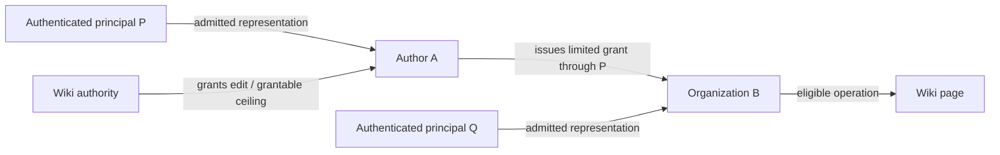

# Access storage, object authority and ordered policy evaluation

Research measured 2026-09-22; active architecture reconciled 2026-09-23. Recommend **ordinary PostgreSQL plus a
bounded Access evaluator inside Main** for the first release. The
[implementation plan](../implementation/access-control.md) fixes the proposed
ownership, records, policy pipeline and delivery sequence. The deeper review ran
matched probes against PostgreSQL, Fluree, SpiceDB/PostgreSQL and OpenFGA/PostgreSQL.
Fluree has since been retired from the product architecture; its earlier license
eligibility and measured results below remain historical facts. Fuseki/TDB2 now
owns product RDF, while private authority remains PostgreSQL. SpiceDB remains a
credible later specialized evaluator. The recommendation emphasizes coherent authority
inputs and local workflow transactions, not a general performance ranking.
No application deployment or runtime acceptance is activated by this research.

The follow-up [depth, representation and voting study](access-depth-representation-and-voting.md)
examines the limits of linear-chain measurements, explicit cross-organization
authority and institutional voting. Its core semantics are adopted in the owning
contracts; workload parameters and production acceptance remain unqualified by
the earlier stationary cases.

## Confirmed requirements and decision boundary

- An author/organization object can receive rights and can issue grants through
  a principal authorized to represent it. Rights must not be flattened onto its
  current controller accounts.
- A jointly maintained wiki can exclude eligible member sets of other Realms.
  Match either the authenticated principal or the selected acting object; support
  both predicates and their explicit combinations.
- Resource policies support meaningful rule ordering. Complexity, revocation,
  query work and explanation must remain bounded and observable.
- Personal Realm muting and blocking are also in scope for the design, while
  resource access and personal presentation preferences remain distinct contracts.
- Source-accessible software that can support the intended initial deployment
  without mandatory up-front payment is acceptable, including Fluree-style BUSL
  terms. OSI-approved licensing is not a required filter. Record applicable use,
  feature, trial and later-payment conditions accurately. Redis remains outside
  the first release.

[Identity/access](../contracts/identity-and-access.md) already distinguishes
principals, Agents, grants and representation. That is useful prior design, not
proof that its current database selection is optimal. This review separates the
database, policy engine, grant-management workflow and process placement.

## Historical database and product comparison

This section preserves the 2026-09-22 alternatives and license/source review.
Fluree-specific deployment suggestions describe the retired design space, not
current implementation choices. No Jena benchmark or policy-engine equivalence
is implied; the current application bridge is described below.

Licenses below concern the cited artifacts, not similarly named hosted/enterprise
offerings. Both open-source and accepted source-available licenses qualify under
the user's criterion when the intended initial use does not require payment.
Pin and recheck actual release/dependency terms and required feature availability
when packaging a deployment. Formal license classification alone does not decide
technical suitability.

| Candidate | What it supplies | Fit and cost |
| --- | --- | --- |
| Native PostgreSQL 18 | SQL transactions, indexes, constraints and recursive queries; [PostgreSQL License](https://www.postgresql.org/about/licence/). | Recommended storage baseline. Can keep memberships, grant lifecycle, policy revisions, receipts and fences atomic locally. REZICS still implements and qualifies authorization semantics. |
| Fluree 4.2.1 + Main Access evaluator | Native graph queries, conditional transactions and history; [BUSL-1.1 with Additional Use Grant](https://github.com/fluree/db/blob/v4.2.1/LICENSE). | Eligible under the clarified criterion. Compare private authority isolation, current-policy evaluation against historical content, conditional grant updates, revocation and mixed-load latency. Prior interaction probes do not qualify Access behavior. |
| MySQL Community 8.4 | Another open-source SQL option, including [recursive CTEs](https://dev.mysql.com/doc/refman/8.4/en/with.html); [license inventory](https://raw.githubusercontent.com/mysql/mysql-server/8.4/LICENSE). | Plausible technically; no comparison establishes it as slower. It adds another operational stack beside the selected Account/PostgreSQL without a demonstrated Access benefit. |
| SQLite | Embedded SQL with [public-domain source](https://www.sqlite.org/copyright.html). | Credible for a single-owner prototype. Its [concurrency/network guidance](https://www.sqlite.org/whentouse.html) makes shared multi-process/host authority a different deployment problem; no need to add that problem while PostgreSQL is already present. |
| PostgreSQL + SpiceDB 1.56.2 | Specialized relation evaluator, consistency tokens and relationship APIs; [Apache-2.0](https://github.com/authzed/spicedb/blob/v1.56.2/LICENSE). | Strong alternative for substantial relationship evaluation and reuse. Uses ordinary PostgreSQL without nonstandard extensions, but adds an engine/process and an application-to-engine lifecycle boundary. [Datastore contract](https://authzed.com/docs/spicedb/concepts/datastores). |
| PostgreSQL + OpenFGA 1.21.0 | Typed relation models, usersets, conditions, blocklists and query APIs; [Apache-2.0](https://github.com/openfga/openfga/blob/v1.21.0/LICENSE). | Credible alternative. [PostgreSQL setup](https://openfga.dev/docs/getting-started/setup-openfga/configure-openfga) and [consistency modes](https://openfga.dev/docs/interacting/consistency) are distinct choices from the business grant workflow. Its Go library is not a native Rust module. |
| PostgreSQL + Cedar 4.13 | Rust policy evaluation/validation, not a database or grant store; [Apache-2.0](https://github.com/cedar-policy/cedar/blob/main/LICENSE). | Useful if rich typed conditions warrant a policy language. Entity loading, graph freshness and grant management stay with REZICS. Native forbid-wins semantics do not implement arbitrary first-match rule order. |
| PostgreSQL + Apache AGE | [Graph/Cypher extension](https://age.apache.org/) under [Apache-2.0](https://github.com/apache/age/blob/master/LICENSE). | Adds graph syntax, not our authority lifecycle or combining algorithm. No observed query need currently justifies the extension and compatibility qualification. |
| Supabase self-hosted stack | PostgreSQL plus authentication/API/storage and other services; [self-hosting scope](https://supabase.com/docs/guides/self-hosting), [root repository license](https://github.com/supabase/supabase/blob/master/LICENSE). | A platform packaging choice, not an authorization algorithm. Would overlap Account/Elysia and add components. Individual component licenses/features still require their own review; the root Apache license is not a blanket license for every hosted feature. |

Fluree 4.2.1 is included in the Access comparison. Its formal source-available
classification does not disqualify it: the user explicitly accepts this class of
license. Its Additional Use Grant permits internal application use within the
specified boundary and restricts certain database-service offerings. Evaluate the
actual intended use against those terms instead of equating either source access
or a non-OSI label with a universal free-use or exclusion conclusion.

The historical Fluree alternative compared a private authority ledger with protected
graphs in a shared product ledger. The former preserves stronger storage separation
but retains a cross-ledger consistency boundary; the latter may permit joint local
transactions but requires private-data isolation and current authorization even
when reading old content. Those were candidates to qualify, not a decision to move
Account credentials or to treat the semantic graph as authority automatically.

Do not confuse SpiceDB/OpenFGA with a PostgreSQL distribution. Their engines own
their persistence schemas and protocols. Do not write their tables from Main as
an integration shortcut. If selected, choose which security facts the engine owns
and use staged activation/revocation for accompanying workflow metadata; running
both on one PostgreSQL server does not make two service API calls one transaction.

PostgreSQL RLS can defend private tables, but it is not by itself the product
permission model, nor does it protect an external graph service (currently Fuseki). Owners and bypass roles also require
careful configuration. [PostgreSQL row-security behavior](https://www.postgresql.org/docs/18/ddl-rowsecurity.html).

## Historical executed four-backend comparison

**Retired-engine evidence: no Jena path was executed.** The backend names and
numbers below deliberately retain their original identities. The PostgreSQL
observations inform Access design but do not qualify its composition with Jena.

The [reproducible lab](../../scripts/research/access_backend_comparison/README.md)
uses verified Fluree 4.2.1, SpiceDB 1.56.2 and OpenFGA 1.21.0 binaries plus local
PostgreSQL 18.6. Both specialized engines used PostgreSQL, not their in-memory
test stores. Synthetic data, clients, configurations, query variants and raw
[run evidence](../../scripts/research/access_backend_comparison/evidence/2026-09-22/environment.json)
are retained with the research scripts. Redis and paid/cloud features were not used.

Each path passed the same **12 stationary scenarios** for representative binding,
nested representation, dependent grants, immediate subsequent checks after parent
revocation, both Realm-exclusion identity bases and rule reordering. The ordered
combiner was common application code; passing does not mean any engine natively
implements our whole product contract. The fixture uses one parent per dependent
grant. Mutation admission, approvals, confidentiality and full lifecycle invariants
remain separate qualification.

### Observation 1: batch transport is not a common authority snapshot

The concurrency probe atomically alternated between:

- State A: no qualifying grant and no excluded-Realm membership — deny.
- State B: qualifying grant and excluded-Realm membership — deny.

No committed state permits access. The reader assembled representation, exception,
principal exclusion, actor exclusion and grant predicates into the ordered decision.

| Path and selected consistency | Decision reads | Invalid allows observed |
| --- | --- | --- |
| Native PostgreSQL, one repeatable-read transaction | 150 | 0 |
| SpiceDB/PostgreSQL, fully-consistent bulk check | 150 | 0 |
| OpenFGA/PostgreSQL, HIGHER_CONSISTENCY BatchCheck | 150 | 8 |
| Fluree, shared-snapshot multi-query on one ledger | 150 | 0 |

The OpenFGA observation is a **counterexample to this application composition**,
not a claim that all OpenFGA authorization is unsafe or that its documented contract
was violated. BatchCheck dispatches individual checks, and the PostgreSQL reader
selects the pool and executes reads without an exposed shared revision for the
whole batch. HIGHER_CONSISTENCY bypasses caches; it must not be treated as a
shared-snapshot promise. A different single-permission model or an application
generation/fencing protocol requires its own qualification.
[BatchCheck source](https://github.com/openfga/openfga/blob/v1.21.0/pkg/server/commands/batch_check_command.go),
[PostgreSQL reader](https://github.com/openfga/openfga/blob/v1.21.0/pkg/storage/postgres/postgres.go),
[recorded counterexample](../../scripts/research/access_backend_comparison/evidence/2026-09-22/snapshot-composition.json).

Zero observed invalid allows does not prove general correctness of the other
compositions. It identifies which tested primitive provided a useful boundary.
PostgreSQL transactions, SpiceDB's checked revision and Fluree's same-ledger
snapshot still do not atomically include a later content write in another store.

### Observation 2: current authority and historical data are different inputs

In the Fluree probe, a required dynamic read policy tested a grant stored in the
same ledger as synthetic content. After revocation, a current query returned no
content; a query pinned to the earlier snapshot returned the content under the
earlier grant. Adding a current explicit required deny also blocked the old content.
This is historical-snapshot behavior, not an engine vulnerability claim. It proves
that the desired current-disclosure contract needs an explicit current-authority
input; choosing one graph engine does not supply it automatically.
[Recorded policy experiment](../../scripts/research/access_backend_comparison/evidence/2026-09-22/fluree-history-policy.json).

Reversing the native inline allow/deny policy array did not produce first-applicable
semantics: both tested orders denied. Fluree's native combining/enforcement layer
can implement qualified constraints, but should not be equated with the editable
product rule list. Its cross-ledger policy source transports governance rules;
it does not automatically contribute the model ledger's identity records to the
data ledger. Some cross-ledger freshness/pinning fields remain unsupported in
this version. [Policy model](https://github.com/fluree/db/blob/v4.2.1/docs/security/policy-model.md),
[cross-ledger contract](https://github.com/fluree/db/blob/v4.2.1/docs/security/cross-ledger-policy.md).

### Observation 3: query shape matters more than a graph/SQL label

After adding 12,000 unrelated edges, an initial Fluree query using zero-or-more
ancestry and nested negation took roughly 31 ms for the grant predicate in this
probe. Separating direct assignments from dependent ancestry reduced the observed
grant checks to roughly 0.6–0.8 ms while preserving the stationary cases. The final
measurement uses the corrected query and Fluree's multi-query envelope, not five
sequential HTTP round trips.
[Query variants](../../scripts/research/access_backend_comparison/evidence/2026-09-22/fluree-query-variants.json),
[original plan](../../scripts/research/access_backend_comparison/evidence/2026-09-22/fluree-original-explain.json),
[multi-query contract](https://github.com/fluree/db/blob/v4.2.1/docs/api/multi-query.md).

All four paths resolved the tested positive linear representation chains at depths
1, 2, 4, 8 and 16. This does not cover high branching, arbitrary cycles or the
product's full ceiling/expiry semantics. It does refute assuming that several
logical layers necessarily require slow serial network calls.

### Local cost observations, not production capacity

Three interleaved rounds of 100 warm/reused-client decision frames per backend
were measured after seeding the unrelated edges. A frame evaluates five predicates;
the batch column is **50 grant checks**, not 50 complete authenticated operations.

| Path | Frame p50 | Frame p95 | Median batch of 50 grant checks |
| --- | ---: | ---: | ---: |
| Native PostgreSQL, repeatable-read SQL pipeline | 0.362 ms | 0.416 ms | 1.956 ms |
| SpiceDB/PostgreSQL, gRPC fully-consistent bulk | 0.624 ms | 0.699 ms | 1.266 ms |
| OpenFGA/PostgreSQL, HTTP higher-consistency batch | 2.136 ms | 3.002 ms | 11.137 ms |
| Fluree/Main, HTTP snapshot envelope and optimized query | 1.209 ms | 1.477 ms | 10.035 ms |

This is one 32-core/64-thread Threadripper host, about 62 GiB visible RAM and
**tmpfs** storage. It is not the planned production hosts, a disk-durability test,
a concurrent capacity test or a comparison with equivalent native SDK transports.
Python/client overhead, different query forms and engine caching remain in the
numbers; actual Main/Rust, login and enforcement/admission costs are absent.
Do not use these values as production SLOs or universal engine rankings.
[Raw measurements and scope](../../scripts/research/access_backend_comparison/evidence/2026-09-22/microtiming.json).

The useful conclusions are narrower: none of these tested local read paths
justifies rejecting an engine solely for latency; bulk sharing can help; Fluree
needs qualified query shapes; and decision coherence is an independent requirement
that a fast BatchCheck cannot replace. Native PostgreSQL remains the recommended
baseline because it also fits the required private workflow/constraint transaction.

## Current Jena boundary

Keep the selected Access evaluator and private workflow transactions in PostgreSQL.
Product graph mutations use the Main-to-Fuseki guarded TDB2 path with application
revision anchors, `{datasetId, dataEpoch, sequence}` receipts and outbox polling.
Fuseki has no Fluree policy engine; Main must enforce graph/text admission and
current disclosure under the [bridge](../implementation/authorization-bridge.md).
Old Fluree historical-policy and query-shape observations motivate counterexamples,
not assumptions about Jena behavior. Qualify new composition and runtime costs
independently before claiming production acceptance.

## Identity and authority model

| Concept | Example | Meaning |
| --- | --- | --- |
| Authenticated principal | A private Account or workload principal | Who actually made the authenticated request. |
| Acting authority subject | An admitted author, organization or other capable object | In whose name the operation is performed. |
| Grant recipient | An authority subject or an admitted member set | Who holds the assigned right. |
| Grant issuer | The authority subject whose grantable power is exercised | Whose authority created the assignment/delegation. |
| Resource/scope | Wiki, page, Realm or subtree | What the right governs. |

Use an extensible `AuthoritySubject` capability with verified lifecycle/control
admission, not a permanent account-only restriction or automatic authority for
every RDF node. Authors and organizations are initial examples. Other Resource
types can qualify through an explicit contract. Editing an author's profile,
importing its name, owning a catalog record or adding `sameAs` never establishes
the ability to represent it.



The grant stores issuer subject, recipient, scope, permission/role revision,
grantability, limits, validity, lifecycle mode and any dependency on an upstream
grant. Audit separately records the actual principal and selected representation
path. Public attribution does not disclose private controller accounts.

### Invite an author

An invitation targets the stable author object. An unclaimed author can receive a
pending invitation; it grants no login capability or automatic identity claim.
Acceptance requires an admitted representative with `accept_invitation` authority,
the exact recipient and current invitation/scope/role conditions. Recheck the
issuer subject's activation authority under the invitation's declared lifetime,
not an assumption that every institutional invitation depends forever on the
individual employee who originally sent it. Activation assigns the author, not
the accepting Account. A change of representative changes who can act for that
author without copying or silently transferring the author's grants.

### Issue another grant

Authority to use, assign, redelegate, change policy and represent are separate.
Possessing edit rights does not itself confer permission to invite editors.
Check one admitted representation path and the issuer's grantable ceiling for the
exact operation; intersect scope/action/validity limits along that proof. Do not
combine unrelated Account rights or incompatible paths to manufacture a stronger
proof. Record multiple independent grant sources separately so revoking one does
not erase another valid source of the same effective permission.

Institutional assignments can outlive their issuing operator. Dependent delegations
remain contingent on their recorded parent and admitted revisions. Revocation
fences dependent use before background cleanup; it does not require deleting all
descendants before becoming effective. Cycles, widening, concurrent reparenting
and loss of the last controller require explicit mutation invariants and recovery.
Historical delegation theory distinguishes issuer, subject, propagation and
intersected authorization/validity; this is a useful basis, not a proposal to adopt
SPKI certificates. [RFC 2693, section 6, Experimental, 1999](https://www.rfc-editor.org/rfc/rfc2693.txt).

## Wiki exclusion, personal muting and interaction blocking

The jointly maintained wiki has one explicit governing policy scope, its authorized
maintainer set and a rule-change approval contract. Do not concatenate every
participating Realm's private policy or let any unrelated Realm rewrite it.
Inherited mandatory restrictions and independent publication contexts remain
explicit; blocking one wiki context cannot retract legitimately public copies
published under another independent authority.

`member_of(realm, basis)` supports at least `principal` and `acting_subject`:

- Principal matching follows the authenticated Account/workload identity across
  acting-subject switches. It does not identify the same natural person behind
  unrelated accounts.
- Acting-subject matching applies to that author/organization's own admitted
  membership. It does not infer membership from all objects an Account controls.
- Explicit AND/OR conditions can combine the two. A Realm membership record has
  a typed subject and admission generation; conversion between kinds requires
  an explicit policy, not an implicit join through every controller.

Reference an admitted membership set in the exclusion rule; do not copy its entire
roster into every page's deny list. Membership changes then affect eligibility
through the current authority/freshness protocol. Under a current-membership rule,
qualified departure removes that particular exclusion. A durable moderation ban is
a distinct record and need not disappear on leaving/rejoining.

Only permit reference to membership sets admitted for that policy purpose. Arbitrary
queries against private Realm membership can create an inference oracle through
allow/deny changes. Keep detailed reasons restricted and treat unavailable required
evidence as unavailable, not proof of non-membership. If anonymous readers can
read the same protected material, a login-based Realm exclusion cannot guarantee
their exclusion; strict enforcement requires authentication for that surface.

| User intent | Owner and effect |
| --- | --- |
| Keep a Realm's eligible members out of a wiki | Access policy, enforced on pages, assets, search intermediates, aggregates and exports within the protected scope. |
| Hide a Realm from my reading experience | Private reader preference plus feed/search selection; it does not revoke that Realm's access rights. |
| Stop its members contacting or interacting with me | An interaction admission rule for the relevant inbox/reply/mention operations; not a global content-view prohibition. |

Preference matching also declares whether it means publishing Realm, current
author membership or selected publication context. Apply selection before relevant
ranking/pagination. Reuse safe condition definitions where helpful, while retaining
separate owners and consequences for Access and reader preferences.

## Ordered rules without an arbitrary-programming hot path

Recommend a **versioned, scope-owned first-applicable rule list**, after mandatory
authentication, representation, credential ceilings and hard enforcement guards.
Only the scope's editable rules can be reordered. Creating/reordering rules is an
authority-changing operation with grantability checks and impact preview; a high
priority number never creates authority to override a stronger parent restriction.

Example rules for one wiki:

1. Allow admitted author A for the specified action.
2. Deny when the authenticated principal is a member of Realm X.
3. Deny when the acting subject is a member of Realm Y.
4. Allow an existing qualifying reader/editor grant.
5. Otherwise deny.

Moving rule 1 below rules 2/3 removes that exception. Hard platform/account/resource
restrictions are outside this editable order. A rule can establish a scoped allow
only within the policy issuer's authorized ceiling. Each result records the policy
revision and deciding rule privately. An unresolved earlier rule cannot be skipped
in favor of a later allow. Model allow, deny, not-applicable and indeterminate
separately; indeterminate never authorizes execution.

First-applicable and deny-overrides are different combining algorithms, not two
ways to sort the same list. XACML 3.0 Appendix C specifies both; reuse the semantic
distinction without adopting its XML stack or claiming full XACML conformance.
[XACML 3.0, OASIS Standard, 2013](https://docs.oasis-open.org/xacml/3.0/xacml-3.0-core-spec-os-en.html).

SpiceDB has [union/intersection/exclusion](https://authzed.com/docs/spicedb/concepts/schema),
and OpenFGA explicitly documents [group blocklists](https://openfga.dev/docs/modeling/blocklists).
Both can express Realm exclusion. An arbitrary ordered list needs an application
combiner or compilation into additional predicates/set expressions; compare that
whole path, not one standalone Check request. Preserve selected-actor binding so
checking a principal does not union every author it could represent.

Cedar's default is forbid-wins and its evaluator skips policies that error. A
REZICS adapter would need complete inputs and deliberate error handling to preserve
mandatory exclusion/first-applicable behavior. Loading policies in a different
order does not change Cedar into a first-match evaluator.
[Cedar authorization semantics](https://docs.cedarpolicy.com/auth/authorization.html).

For the first implementation, admit a finite registry of typed, side-effect-free
conditions: typed membership, approved representation/grants, scope/action and
trusted contextual values. Conditions cannot issue arbitrary SQL, HTTP or public
graph queries. This supports the stated cases while keeping evaluation measurable.

## Performance design and comparison criteria

Logical layers do not require one network request per layer. Resolve the selected
principal/actor context once, identify candidate rules by scope/action, fetch needed
memberships and grant/path inputs in bounded batches, then evaluate the compiled
rule list in Main. Compilation and structural validation happen when a policy
revision is published. In-process compiled-policy caching is not Redis and does not
justify caching an allowance past its authority fence.

PostgreSQL has [recursive traversal/cycle detection](https://www.postgresql.org/docs/18/queries-with.html)
and [multicolumn indexes](https://www.postgresql.org/docs/18/indexes-multicolumn.html).
Use keys such as `(realm, subject)`, `(recipient, scope, action)` and explicit
representation/grant identities. A Realm of a million members does not require
loading its roster to test one subject. This is a query-design observation, not a
latency measurement. Do not enumerate every representation path or precompute all
Account-by-resource combinations on each request.

Cycles need protection on concurrent mutation as well as traversal. Budget depth,
candidate paths, conditions, rows, bytes and time; budget exhaustion is explicit
unavailable, not an invented semantic denial or a partial allow. The current
SpiceDB documentation likewise describes configurable traversal limits and errors;
an off-the-shelf evaluator does not remove this concern.
[Traversal limits](https://authzed.com/docs/spicedb/modeling/recursion-and-max-depth).

Qualify native PostgreSQL/Main together with actual Jena content/query enforcement
using the same complete decision and freshness requirements below. Reconsider
PostgreSQL/SpiceDB or PostgreSQL/OpenFGA only for a demonstrated evaluator need;
repeating the retired Fluree comparison is not a first-release gate:

| Axis | Proposed experimental points |
| --- | --- |
| Representation/delegation depth | 1, 2, 4, 8; include alternate paths and invalid cycles. |
| Rules per policy | 10, 50, 200; early hit, last hit, no hit and unknown earlier exclusion. |
| Realm membership sets | Small/large populations with hot scopes; lookup one subject, not roster expansion. |
| Checks per request | 1, 50, 200 targets; reuse the same selected actor context. |
| Change/failure load | Membership and policy churn, parent revocation, stale cache/replica, timeouts and recovery. |

These are test coordinates, not first-release product limits. Record end-to-end
p50/p95/p99, database/network round trips, rows examined, CPU/memory, queueing,
revocation visibility and ListObjects/filter completeness. Agree budgets before
comparison. Retain the simplest implementation that meets them and reconsider a
specialized engine if maintained relationship complexity/query load justifies it.

Zanzibar supplies production evidence for normalized relation tuples, causal
consistency, caching and batching at scale. It does not certify our workload.
[Zanzibar, USENIX ATC 2019](https://storage.googleapis.com/gweb-research2023-media/pubtools/5068.pdf).
The Cedar research comparison explicitly factors out persistent-data loading and
uses an older in-memory OpenFGA backend; it cannot establish which PostgreSQL-backed
end-to-end option is faster here.
[Cedar paper, 2024, section 5.2](https://arxiv.org/html/2403.04651v2).

One PostgreSQL authority transaction can commit its local grant/membership/policy
change, audit and fence. It does not atomically include a later Jena mutation or
stream response. The existing [admission/authorization bridge](../implementation/authorization-bridge.md)
still governs those effects. In particular, strict revoke must close new admission
and drain/cancel affected work under the declared contract. Snapshot reads and
minimum-revision tokens are not a substitute for that stronger boundary.

## Executed probe and remaining work

The [PostgreSQL probe](../../scripts/research/access_policy_probe.py), with its
[SQL fixtures](../../scripts/research/access_policy_probe.sql), ran against an
isolated PostgreSQL **18.6** cluster on 2026-09-22. All **25** assertions passed.
It covers object recipient/issuer examples, representation/action/scope separation,
dependent versus institutional lifetime, both Realm-exclusion identity bases,
rule order, mandatory guards, unknown membership evidence, muting and revocation.

This is illustrative semantics only. Fixture writes are trusted setup, not a
qualified invitation/grant-administration API. The recursive functions are not a
production evaluator: it does not validate every parent ceiling, expiry, concurrent
cycle mutation, authorization-data privacy, cross-store fence or query-plan cost.
The original 25-case probe was not a product-engine comparison. The four-backend
study above adds bounded comparison evidence; neither is a capacity benchmark.
The temporary server uses its own Unix socket and is stopped after the probe;
no existing database is used.

```sh
python -B scripts/research/access_policy_probe.py
```

The [implementation plan](../implementation/access-control.md) specifies the
recommended condition-registry boundary, governance/inheritance responsibilities,
membership disclosure, invitation/grant lifecycle and release sequence. Remaining
work is production implementation and qualification, including concurrent mutation,
real content-query enforcement, recovery and representative load on the deployment
hosts. Broader conditions or measured relationship workloads can justify another
evaluator; the confirmed object/identity/exclusion semantics must survive that choice.
