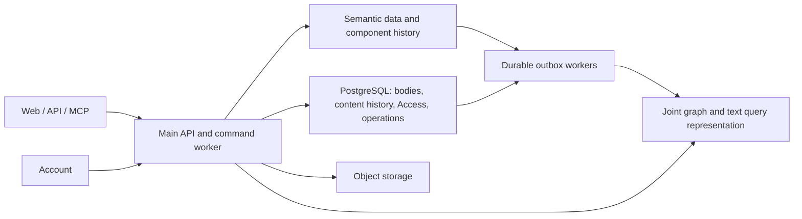

# REZICS storage architecture evaluation

Date: 2026-09-24. Status: research retained after the maintainer selected
**PostgreSQL + Jena/Fuseki/TDB2 + embedded jena-text/Lucene** for startup.
The [architecture overview](../architecture/overview.md), [Content binding](../storage/postgresql.md)
and [search projection](../contracts/search.md#postgresql-body-projection) own the
adopted design. Alternatives and measurements below explain the decision and
remain fallback evidence; they do not keep engine selection open. This is not a
completed migration or performance qualification. P0.8 owns the implementation gate.

## Decision and scope

The question is which system should own each invariant and execute each important
query, not whether every relationship can be encoded in a SQL table. A relational
table can represent triples; doing so does not automatically supply an RDF term
model, variable-predicate planning, named contexts, statement provenance or useful
graph traversal. Conversely, a graph engine does not make every bounded join
faster than an indexed relational query.

The selected design is **semantic ownership, document/operations
ownership, and one engine-planned execution of each combined graph/text query**,
behind one modular Main application and one semantic/i18n model. Logical owners
do not imply three database products. Prefer an existing integrated semantic
search system, or a maintained integration with a qualified complete query plan,
before building a general cross-store query coordinator ourselves.

For this startup, Jena supplies that query execution boundary and PostgreSQL
supplies Content/operations. The initial body binding deliberately reuses the
existing RDF MatchUnit/text-wrapper machinery: an exact PostgreSQL revision feeds
derived searchable RDF literals, then embedded Lucene. Budget all three physical
representations and their update cost. External-content Lucene indexing remains
an alternative binding with its own lifecycle work, not an initial dependency.
OpenSearch, Virtuoso, QLever and the other compared engines are not selected.

The deployment constraint is **self-hosted open-source software, or
source-available software whose restrictions permit the intended deployment**.
Purely proprietary products and required closed commercial modules are excluded
from the final stack. Commercial systems can teach architecture without becoming
deployment candidates. Check the actual edition, version and required features;
an open core does not make its proprietary clustering or connector modules
eligible. Paid support for eligible software is a separate question.

The earlier selection of **Jena/Fuseki/TDB2 + PostgreSQL + OpenSearch** was
premature. It is retained below as an executable reference architecture, not the
established winner. Individual precedents for outboxes, graph storage and search
do not establish that this composition is the least costly complete solution.
The [complete-system comparison](#complete-systems-and-reference-architectures)
informed the final ownership/query boundary. MarkLogic is a completeness
reference, excluded from deployment under this constraint. Virtuoso Open Source
is an integrated challenger; QLever supplies direct SPARQL+Text research and an
open implementation. The [architecture-to-implementation mapping](#self-hosted-implementation-of-the-learned-architecture)
also uses Wikimedia's update pipelines to cover ingestion and recovery. None of
these alternatives has qualified the complete REZICS workload.

In the selected split-owner design, the semantic owner includes names, titles, predicate definitions/labels, typed
claim values, qualified relation occurrences, context decisions and published
revision references. PostgreSQL owns document bodies and their revisions,
drafts, reader preferences, Access and operational transactions. Split by the
invariant and aggregate being edited, not merely string length or whether a
field is called a relation. An annotation document is Content; its attribution
and semantic target are graph facts. Every field has exactly one writer.

This supersedes the previous relationship-only Fluree/all-text-in-PostgreSQL
proposal. That boundary is possible, but it moves ordinary name/value filters
out of graph queries and creates additional vocabulary/value coordination. It
has no demonstrated end-to-end advantage here. Keeping semantic labels and
values together with their assertions makes their edits, validation and graph
queries local; moving independently edited bodies and high-frequency operations
out avoids forcing those workloads through the graph writer. These are design
deductions from REZICS's workload, not conclusions established by a vendor paper.

The maintainer clarified that this is a social-media product: all content may
propagate with delay and most workflows may complete asynchronously. This
supersedes the earlier assumption that ordinary discovery/publication needs one
instantaneous cross-store snapshot. Default to durable acceptance, owner-local
commit and asynchronous visibility. Preserve local integrity and truthful
operation status; do not impose distributed transactions on ordinary content.
Native i18n applies to every human-language field, including extensible predicates.
The latest clarification separates localized metadata, independently published
translated Works, and language variants within a native REZICS Main Version.
Ordinary translation choice is a reader preference, not mandatory Realm adoption.

If the OpenSearch design is selected for ordinary social discovery, its projection contains both
the searchable text and the common relationship/context conditions, evaluated
before ranking and top-K. It is not a text-only service followed by per-hit graph
checks. Deep or ad hoc graph exploration stays in the graph service. Small,
complete candidate-ID exchanges are valid when measured; large distributed joins
are not the default search plan. This separation has production precedents below
and a bounded REZICS probe, but no claim of arbitrary graph queries at text-search
cost. Search replicas do not acquire write authority.

Jena's native RDF terms, named graphs, SPARQL and SHACL reduce the semantic binding
needed for this model. Its explicit limitation is one active TDB2 writer, and
the required in-transaction command/validation module is not implemented yet.
Keeping Jena is therefore conditional on that module and the admitted mixed-load
budget; existing code alone is not a reason to accept a failing design. Moving
drafts, operational slots and discovery to their owners reduces writer load but
does not prove sufficient capacity. Native engine history is not a prerequisite
for exact component revisions; use the common history protocol below.

The previous recommendation of PostgreSQL/PGroonga based on eleven CJK substring
fixtures was too broad. Those fixtures do not establish complete ranked search
under Realm selection, classification, ratings and occurrence conditions. Native
Fluree BM25 is also a genuine graph/text option; splitting search is a workload
and lifecycle choice, not a claim that Fluree cannot combine the two.

The maintainer's latest performance constraint is a hard qualification condition:
every interactive operation needs a fixed upper bound on complete backend request
attempts, not merely an average or a page-size limit. This tightens the earlier
allowance for a variable residual scan. Such scans leave the ordinary synchronous
path unless their maximum calls and work are established before execution.
Every proposed engine arrangement remains conditional on passing this requirement;
the retained small probes do not establish end-to-end performance safety.

The evaluation covers Work reads, sparse Realm decisions, bounded traversal,
publication by immutable reference, CJK matching and cross-store query execution.
It also checks the consequences for M01–M10 rather than promoting the fastest
isolated query into a whole-product design. The existing contracts remain the
requirements: explicit reject blocks fallback, absent may inherit, unavailable
is not absent, current disclosure governs history, and truncated candidates are
not a complete empty answer. Earlier engine-specific and global-freshness clauses
need explicit reconciliation with this target before implementation; they must
not be treated as immutable product requirements during the redesign.

## Alternatives beyond Jena and Fluree

The maintainer's earlier database discussion
(`rezics/.temp/discussion/db chosen/fluree-vs-dgraph-deep-comparison-and-decision-2026-09-22.md`)
correctly distinguishes a semantic contract from native engine features. Native
SPARQL, SHACL or history can reduce implementation work without being mandatory
eligibility conditions. Its later Dgraph recommendation was a source/design
assessment, not a same-workload runtime victory. This review keeps that distinction
and uses the current TypeScript, native-i18n and delayed-visibility requirements.

| Architecture or engine | Strongest reason to choose it | REZICS assessment |
| --- | --- | --- |
| PostgreSQL canonical records/history/outbox; graph and search replicas | One durable product write boundary, simple publication and recovery; closest to Wikibase's entity/revision pattern. SQL need not execute general graph queries: typed claim records can feed a graph replica. | Credible runner-up architecture, not disqualified by triples. Its cost is implementing graph-dependent write invariants over authoritative records/dependency heads instead of validating against the writable semantic graph. A stale replica cannot approve an invariant-sensitive commit. Prefer it if edits can be aggregate-local and relationship checks can be explicitly delayed/rejected. Current contextual graph operations make the graph-authority design a better fit. |
| Jena semantic owner + PostgreSQL + OpenSearch | RDF terms, variable predicates, named contexts and graph-local validation/querying align directly with the model; durable revision records need no engine fork. | Retained reference design, no longer the selected winner. Single-writer throughput, command-module correctness and the application-maintained search projection remain gates. Compare the total work with existing integrated systems below. |
| RDF4J semantic owner + PostgreSQL + search | ShaclSail already validates supported shapes on transaction commit and handles affected data; could reduce custom transactional validation work. | Closest alternative within the same architecture. Compare actual profile coverage, affected-focus behavior, backend and validation cost. LuceneSail's existence does not prove every SHACL/backend/index combination is crash-atomic. No REZICS runtime comparison here establishes it as a winner or loser. |
| Dgraph semantic owner + PostgreSQL + search | Transactional graph operations and distributed storage; application revision nodes can replace a native history requirement. | The new bounded probe below makes it a real challenger. RDF term fidelity, generic predicates/contexts and constraints require a deliberate DQL binding. Tablet partitioning is by predicate: mapping every claim through a few generic predicates can concentrate load. One Alpha cannot validate distribution or capacity. Prefer it over Jena if the qualified distributed-write workload justifies that binding and operational cost. |
| Fluree semantic owner + PostgreSQL; native BM25 or OpenSearch | Native semantic terms, integrated graph/text and retained historical facts reduce some application machinery. | Viable, but native history alone no longer decides the choice once content and semantic components share an application revision contract. Pinned 4.2.1 BM25 has a documented English analysis pipeline; required CJK/ranking profiles need qualification. SQL federation has the measured batching/snapshot/value limits below. |
| ArangoDB document/graph/search owner + PostgreSQL control plane | AQL graph traversal, documents and ArangoSearch make it a serious option for keeping body/graph query work together. | May simplify composition, but still needs REZICS occurrence/i18n/history semantics and a measured joined-ranking plan. Eligibility requires a source-available edition whose terms permit this production workload and whose included features suffice. A required closed Enterprise feature excludes that deployment. No runtime comparison here. |
| Neo4j or SurrealDB semantic/document owner | Native graph/document querying and full-text capabilities; viable without demanding native RDF. | Need lossless semantic bindings, component history and workload evidence. Neo4j 2026.09 adds Cypher full-text SEARCH; an older claim that only procedural full-text entry points exist would be stale. Neither feature availability proves REZICS's full filtered top-K or update cost. |
| PostgreSQL + Apache AGE | SQL, Cypher graph access and document storage in one PostgreSQL deployment. | AGE 1.7.0 has a PostgreSQL 18 build, so version incompatibility is not grounds for dismissal. A combined query surface still needs planner, transaction/constraint and operational qualification for this workload; not tested here. |
| Oxigraph | Compact Rust/RocksDB SPARQL engine and standard RDF storage. | Eligible when its service, constraint and search integrations reduce total work. The 0.5.11 README itself cautions about query evaluation maturity; no REZICS test here justifies replacing the currently measured binding. |
| TerminusDB / XTDB | Version-oriented data workflows / bitemporal querying respectively. | Stronger candidates if whole-dataset branching, merge or arbitrary historical-time queries become primary workloads. Exact component revision reads and restoration alone do not require those architectures. |
| QLever | Large RDF query workloads and integrated SPARQL+Text mechanisms. | A possible read projection or separately qualified owner. Current QLever supports updates; it is not accurately described as read-only. Update support alone does not qualify command receipts, constraints, history and text-index maintenance. |
| PostgreSQL/PGroonga relationship-aware read model | Text and projected relation filters can use local SQL; avoids a separate search service. | Keep eligible if that complete read model wins on relevance, query/update cost and operations. A text-only PGroonga stage feeding a large graph join has no demonstrated advantage over OpenSearch. |

Mechanism sources: [RDF4J transactional SHACL](https://rdf4j.org/documentation/programming/shacl/),
[LuceneSail](https://rdf4j.org/documentation/programming/lucene/),
[Dgraph tablets](https://docs.dgraph.io/design-concepts/posting-list-concept/),
[Fluree BM25](https://raw.githubusercontent.com/fluree/db/v4.2.1/docs/graph-sources/bm25.md),
[Fluree analysis](https://raw.githubusercontent.com/fluree/db/v4.2.1/docs/indexing-and-search/bm25.md),
[ArangoSearch](https://docs.arango.ai/arangodb/stable/indexes-and-search/arangosearch/),
[ArangoDB editions](https://docs.arango.ai/arangodb/stable/features/),
[Neo4j full text](https://neo4j.com/docs/cypher-manual/25/indexes/semantic-indexes/full-text-indexes/),
[SurrealDB full text](https://surrealdb.com/docs/learn/data-models/full-text-search/scoring-and-ranking),
[AGE downloads](https://age.apache.org/download/),
[Oxigraph 0.5.11](https://github.com/oxigraph/oxigraph/blob/v0.5.11/README.md),
[TerminusDB versioning](https://terminusdb.org/docs/git-for-data-reference/),
[XTDB concepts](https://docs.xtdb.com/concepts/key-concepts.html),
[QLever updates](https://docs.qlever.dev/update/).

This is a comparison of implementation responsibilities, not an additive feature
score. Lack of a test is recorded as unqualified, not as failure. No source or
local probe proves that any one engine is globally best. Feature inventory alone
does not answer which existing system already owns the difficult composition.

## Complete systems and reference architectures

The maintainer requested existing solutions to study and reuse, not just papers
supporting a design already chosen. The comparison therefore asks who implements
the combined logical plan, physical joins, ranking, index maintenance and recovery.
Semantic Web standardizes a substantial part of the data/query contract; it does
not choose one full-text algebra, tokenizer, distributed physical plan or revision
policy. An integrated implementation can supply those mechanisms without becoming
the definition of REZICS's product semantics.

Sources below were checked on 2026-09-24. Academic systems, current products and
vendor deployment accounts have different evidentiary roles. The maintainer's
explicit deployment constraint admits open-source and suitable source-available
software, and excludes purely proprietary dependencies. Study complete commercial
architectures where useful, then identify an eligible implementation of each
required mechanism. A diagram that replaces a proprietary engine with an open
database name does not establish equivalent capabilities.

| Complete solution | What the existing system takes over | REZICS work or decisive boundary |
| --- | --- | --- |
| MarkLogic Server + Optic/TDE | JSON/XML documents, RDF triples, text and structural indexes, joint row/graph/document query execution, transaction and cluster infrastructure. | Architecture reference only; excluded from deployment. Learn co-located indexes, combined planning and late document retrieval. Realm rules, revision identities and translation provenance remain application semantics. |
| Virtuoso Open Source | RDF/SPARQL, local relational storage and native full-text operators planned within one DBMS; built-in text maintenance controls. | A real integrated open-source challenger. Qualify CJK relevance, occurrence/context plans, update visibility, constraints and the exact edition's deployment limits. Native integration alone is insufficient. |
| QLever | SPARQL+Text operators, combined cost-based planning, RDF and external text-record indexing, large graph query execution. | Particularly useful as a read engine. Current update persistence, accumulated-delta behavior and continuous text maintenance need separate qualification; the 2017 paper is not an OLTP/recovery certification. |
| GraphDB Enterprise + OpenSearch Connector | Declarative RDF-to-search mapping, entity/property-chain synchronization, nested fields, search invocation through SPARQL. | Architecture reference only; the Enterprise connector is excluded from deployment. Learn projection mapping and maintenance. It does not establish arbitrary graph-filter pushdown or complete final top-K after a limited connector result. |
| Siren Federate + Elasticsearch | Search-native distributed relational joins, adaptive planning, compact intermediate representations and graph exploration. | Architecture reference only; excluded from deployment. Its optimizer and join operators are substantial engine machinery, not features obtained by configuring an OpenSearch connector. |
| Stardog native search | RDF-local search index, SPARQL search operators and graph-binding-aware optimization. | Architecture reference only; excluded from deployment. Learn passing graph bindings into local text evaluation; virtual-source search is not supplied automatically. |
| ArangoDB + ArangoSearch | One AQL execution surface for documents, traversal and ranked text search, with an optimizer and profiling. | Conditional candidate only through an eligible source-available edition. Requires a deliberate Semantic Web binding; search visibility, included features and exact cluster transaction scope need qualification. |

### MarkLogic: the most complete integration reference

The current **MarkLogic 12 Optic** API can obtain document-match IDs and scores,
join them to triples or extracted rows, filter, order, limit and retrieve documents
inside a database plan. TDE defines indexed relational/semantic views of stored
documents. This directly addresses the problem of bringing text and relationships
into one executor; it is more than an API gateway over separately executed calls.
The published API exposes execution plans and resource metrics. Putting a limit
before a required join would still encode the wrong query, even in this engine.
Sources: [Optic 12](https://docs.progress.com/bundle/marklogic-server-develop-server-side-apps-12/page/topics/OpticAPI.html),
[TDE 12](https://docs.progress.com/bundle/marklogic-server-develop-server-side-apps-12/page/topics/TDE.html).

The engineering book [Inside MarkLogic Server](https://www.progress.com/docs/default-source/marklogic-docs/inside-marklogic-server.pdf)
(Hunter/Wooldridge, April 2016, MarkLogic 8) covers indexes, transactional storage,
clustering, semantics, replication and failover together. It is a vendor-authored
architecture reference, not a current-version performance comparison. Pair it
with the [current transaction guide](https://docs.progress.com/bundle/marklogic-server-develop-server-side-apps-12/page/topics/transactions.html).
The [BBC account](https://www.progress.com/customers/bbc) describes use in BBC
Sport and iPlayer. That establishes reported production use, not proof that BBC
ran our query shape or that its request figures measure native SPARQL joins.

Current language support also matters: MarkLogic 12 honors hierarchical JSON
`lang`/`language` properties as well as XML language attributes, and documents
Chinese language processing. The old MarkLogic 9 statement that JSON always uses
the database language is obsolete. Language capabilities can depend on licensed
options. This supplies analyzer behavior, not REZICS's identified variants,
official/third-party provenance or personal selection model.
Source: [language support 12](https://docs.progress.com/bundle/marklogic-server-use-search-12/page/topics/languages.html).

REZICS lesson, as a design deduction: keep the text index and relationship
operators in the same query executor, and retrieve large documents after the
complete eligibility/ranking operation. This does not require moving body write
authority out of PostgreSQL. An eligible semantic engine with a local searchable
copy can implement this boundary. MarkLogic's specific optimizer, transaction
manager and distributed execution are not available merely by adopting that
boundary; qualify the chosen open implementation instead. MarkLogic itself is
not a deployment candidate.

### QLever and Virtuoso: integrated Semantic Web query execution

**QLever: A Query Engine for Efficient SPARQL+Text Search** (CIKM 2017) presents
an index design, physical text operators, cost estimates, plan construction and
evaluation together. Its `Text with filter` operator incorporates a graph-derived
set while processing text postings; the optimizer compares it with separate
text execution plus join. This is a complete query-engine approach to precisely
the composition problem, rather than evidence that two unrelated databases are
fast individually. Source: [paper, especially sections 3–5](https://ad-publications.cs.uni-freiburg.de/CIKM_qlever_BB_2017.pdf).

Current QLever accepts both RDF literals and external text records linked to
entities. Thus a PostgreSQL body authority does not force query-time PostgreSQL
text reads: the text record can be a derived representation. However, current
documentation calls persisted updates rudimentary, and describes periodic index
rebuilds as a workaround while continuous incorporation of update triples is
being developed. Neither SPARQL Update nor the separate text-index build command
establishes incremental coherence for every text representation. CJK analysis,
ranking, changes/deletions and crash replay remain unqualified here. Treat it as
a serious read-engine candidate, not an automatically qualified write owner.
Sources: [text interface](https://docs.qlever.dev/text-search/),
[update persistence/settings](https://docs.qlever.dev/qleverfile/),
[rebuild lifecycle](https://docs.qlever.dev/rebuild-index/).

**Virtuoso** integrates RDF full-text predicates with its SQL/SPARQL optimizer,
which can choose text-driven execution or use text as a filter after other
conditions. It provides graph/predicate indexing rules and built-in batch or
synchronous text maintenance; default batch behavior must not be mistaken for
immediate search visibility. This is a mature integrated design to evaluate
before building our own federated optimizer. It does not make a remote PostgreSQL
body locally searchable without an indexed copy or a separately qualified mapping.
The research candidate is [Open Source 7.2.17](https://github.com/openlink/virtuoso-opensource/releases/tag/v7.2.17);
do not transfer commercial-cluster capabilities to that edition by implication.
Source: [native RDF/text integration](https://docs.openlinksw.com/virtuoso/sparqlextensions/).

The bounded native probe now has [retained results](../../scripts/research/storage_architecture/evidence/2026-09-24/virtuoso.json)
and a [full query plan](../../scripts/research/storage_architecture/evidence/2026-09-24/virtuoso-plan.txt).
The final run verified stable binary **7.2.17.3243, commit `c4fd28e38e`** and the
inspected image identity recorded in the toolchain. An earlier image carrying a
7.2.17-looking tag actually reported 7.2.18-dev and was rejected for the final
evidence. On 50,000 Work roots / 200,521 triples:

- The native text + Realm-membership + same-occurrence Agent/role query returned
  all five eligible roots before final `LIMIT 5`. Filtering the text-only first
  100 results by the complete graph condition returned none.
- A deliberately split Agent/role pair matched a naive cross-occurrence query
  and was excluded by the required same-occurrence query.
- After the documented built-in index synchronization, changing one matching
  body left four matches; deleting another matching body left three.
- Native matching agreed with 10 of the 11 existing normalized-substring CJK
  fixture cases. The remaining difference was fullwidth Latin `ＲＵＳＴ` for the
  query `rust`, not a failure of all Chinese matching. Normalization/relevance
  parity is not complete.
- The first broad and joined HTTP queries took approximately 235 ms and 269 ms.
  These are individual local observations, not P95/P99 or a matched-engine speed
  comparison. The plan used the text index before graph predicates, with final
  sorting/top-K afterward; it did not demonstrate graph-first optimization.

The run recorded 17 HTTP query requests and seven `isql` sessions; those sessions
contain multiple SQL statements and are not a count of every protocol round trip.
Each measured search was one HTTP request, with no application candidate-refill
loop. Internal work, mixed-load tails, crash recovery, full Realm fallback/reject,
ratings, Resource grouping across variants and authoritative command invariants
were not qualified. This establishes a working integrated challenger, not a
replacement winner. The disposable container's removal was verified.

### GraphDB and Siren: different complete answers to a split search system

GraphDB's OpenSearch Connector is maintained product machinery for mapping and
synchronizing graph-derived search entities. Its documentation includes property
chains, nested objects, language fields and repair operations. This illustrates
machinery a Jena/OpenSearch design must otherwise supply. But
connector `limit`/`offset` operate on the OpenSearch side; later graph joins are
separate operations and can even change order. Consequently, a connector is not
proof that all later Realm/relationship conditions participate before top-K.
The full joint plan and failure behavior still need inspection. The connector
requires Enterprise; it does not ingest arbitrary PostgreSQL JSON bodies merely
because their revision IRIs occur in RDF.
Source: [GraphDB 11.4 connector](https://graphdb.ontotext.com/documentation/11.4/opensearch-graphdb-connector.html).

**Siren Federate: Bridging document, relational, and graph models for exploratory
graph analysis** (2025 preprint; *Computer Science and Information Systems*
23(1), 2026, pp. 475–512) describes a maintained Elasticsearch compute layer:
columnar intermediates, late materialization, several distributed join strategies,
adaptive planning, caching and path-query decomposition. Its evaluation includes
a 15.6-billion-document synthetic workload on 12–36 nodes, not a REZICS-sized
single-host guarantee. The authors also report substantial latency growth under
concurrency and do not supply a broad cross-system victory. This is the most
direct complete reference here for avoiding application-managed candidate-ID
loops while retaining a search-first distributed system. Internal exchange and
work are still data-dependent. Source: [full paper, sections 4–7](https://comsis.org/pdf.php?id=18397).
The [current license documentation](https://docs.siren.io/siren-federate-user-guide/39/license-apis.html)
distinguishes evaluation from production and separately licenses the graph module.
Do not describe this as a free OpenSearch configuration.

Stardog supplies another maintained local graph/text path, including an optimizer
strategy that passes selective graph bindings into text search. Its documentation
explicitly excludes search over virtual sources. That is an important boundary
for PostgreSQL-resident bodies, and a reason not to equate federation with an
integrated index. Source: [Stardog full-text search](https://docs.stardog.com/query-stardog/full-text-search).
ArangoDB documents composition of graph traversal and ranked search within AQL;
that is a real alternative when the cost of the Semantic Web binding is accepted,
not a reason to claim that native RDF is compulsory.
Source: [ArangoDB query capabilities](https://docs.arangodb.com/3.12/about-arangodb/features/community-edition/).
That older feature page is mechanism evidence, not authority for current licensing.

### Resulting REZICS architecture decision

The strongest deduction is to **co-locate the searchable representation and the
relationships needed by its query inside one maintained execution system**.
Authority may remain split. A JSON revision in PostgreSQL and a plain-text/index
copy in a semantic search engine are compatible; there is no need to fetch every
candidate body or graph fact across the application boundary while searching.

For REZICS this distinction is consequential: dynamic predicates and sparse Realm
decisions can remain queryable relations, rather than requiring a new search
mapping field per predicate or materializing every Resource/Realm combination.
The logical query is the intersection of matching text revisions, effective
selection, occurrence-scoped relationship conditions and rating eligibility,
followed by Resource grouping/ranking and pagination. A native planner can choose
its physical order without changing that membership. Whether its chosen plan is
fast under skew is still a measurement question. A document-search projection
must instead show how its projected fields or maintained joins express the same
conditions without excessive dependency fanout; the five-hit example alone does
not settle that cost.

For the retained split-owner variant, the complete path is:

1. Commit Content revision and its durable event in PostgreSQL. Commit semantic
   selection/relationships and their event in the semantic owner. Publication
   points to an exact prepared revision, following the protocol below.
2. Build the query representation from those exact revisions. Its grain retains
   variant language, occurrence identity, qualifiers, scope and source revision;
   indexing never changes editorial ownership.
3. Submit the text expression and complete admitted Realm/classification/rating
   conditions to one engine-planned query. Compute membership, grouping and final
   ordering before page truncation. Do not insert an application refill loop.
4. Return bounded cards from that executor; fetch exact bodies in one bounded
   batch only when the response needs them. Access, cold starts, cursor setup and
   retry attempts still count toward the complete request's fixed budget.
5. Replay or rebuild derived representations from owner records. Expose pending
   publication/index state; missing exact data is unavailable, not a new version.

The completed comparison led to the maintainer's Jena/Lucene + PostgreSQL startup
selection. Virtuoso Open Source, QLever and RDF4J remain alternative implementations
if a material qualification failure warrants revisiting that boundary; they are
not additional required services or an instruction to continue engine shopping.
ArangoDB remains conditional on an eligible edition and acceptable binding work.
Use commercial references to identify mechanisms, not fallback purchases. Prefer
existing engine operators, index maintenance and transaction implementation;
do not respond to a failed profile by inventing a general query optimizer.

An OpenSearch projection remains a good candidate for a known, bounded set of
social discovery conditions that can execute completely inside that index. It
has not established coverage of dynamic predicates, sparse Realm resolution and
arbitrary relationship composition merely by passing the five-hit probe. If
supporting those conditions requires building a general distributed join layer,
the integrated alternatives have the stronger architectural fit. This is a
workload-dependent choice, not a claim that integration always wins.

The existing literature and product implementations establish that complete
solutions exist. They do not establish a universally fastest engine, constant
internal communication for arbitrary graph queries, or a ready-made REZICS
product. Remaining domain code is identifiable: Realm decisions, revision and
publication policy, translation provenance, disclosure and bounded capability
contracts. Database query planning and generic index machinery should remain
with the selected mature implementation.

### Self-hosted implementation of the learned architecture

The architecture to reproduce is **owner-local transactions, durable change
publication, a complete local query representation, and replayable derived
indexes**. It is not a requirement to deploy every product used by the reference
organization. The following mapping separates supplied mechanisms from REZICS
integration and product semantics; it is a design recommendation, not a newly
qualified installation.

Wikimedia provides a substantial operational reference for the update side.
Its [Search Update Pipeline design](https://wikitech.wikimedia.org/wiki/Search/Update_Pipeline)
(page last edited October 2023) separates small change events, aggregation,
late retrieval of bulk source data, enrichment and search indexing. Kafka carries
intermediate events; Flink maintains processing state, with checkpoints and
recovery infrastructure. This is a concrete ingestion/recovery architecture,
not evidence for arbitrary graph/text joins at query time. Its documented
acceptance of some duplicate/local-fallback inconsistencies is also not permission
to weaken REZICS's Realm rules.

The [WDQS Streaming Updater](https://wikitech.wikimedia.org/wiki/Wikidata_Query_Service/Streaming_Updater)
adds a complementary graph path: compare entity revisions, produce RDF changes,
publish them through Kafka and apply them with a triple-store consumer. Its
documentation includes checkpoint/savepoint operations, lag diagnosis and
bootstrap. Learn revision-aware updates and recoverable producer/consumer
boundaries. Do not copy its storage engine merely because it is the destination
in that deployment, or infer that two independent pipelines provide a single
atomic cross-store snapshot.

| Mechanism learned from complete systems | Eligible implementation direction | Work that remains for REZICS |
| --- | --- | --- |
| Revision-based editorial authority and derived query services: Wikibase/WDQS | PostgreSQL transactions for Content/operations; an eligible semantic owner for graph-local invariants; immutable revision IDs between them. | Domain aggregates, exact publication references, receipt/CAS protocol, owner-specific history adapters. Choosing two owners is our workload deduction, not a claim that Wikibase has this exact split. |
| One plan over text and relationships: QLever, Virtuoso; MarkLogic as a reference | Prefer a native open graph/text engine. Virtuoso Open Source is a measured challenger; Jena/Lucene is the baseline; RDF4J/Lucene and QLever are alternatives with distinct lifecycle/planner qualifications. | Translate admitted product queries and preserve occurrence, Realm and Resource-ranking semantics. No new general join optimizer in Main. |
| Durable update ingestion and recovery: Wikimedia pipelines | Initially, the existing application runtime can run a durable outbox worker. Kafka/Flink are optional open infrastructure when parallel stateful processing and operational load justify them. | Source adapters, exact revision enrichment, dependency invalidation, stale-event fencing and reconciliation. A broker is not the authoritative history. |
| PostgreSQL outbox capture: Debezium's existing implementation | Optional Debezium PostgreSQL connector plus Outbox Event Router, feeding the update pipeline. | Define event identities, aggregate ordering and retained payloads. This connector cannot capture a TDB2 outbox; the graph owner needs its own durable adapter. |
| Search projection maintenance: Wikimedia; GraphDB connector as a reference | OpenSearch plus an eligible pipeline can maintain declared search documents if they contain every condition required by the admitted query. | Compile and maintain the actual projection, preserve correlated occurrences, measure dependency fanout and deletion/rebuild behavior. There is no verified drop-in open replacement for all GraphDB connector behavior here. |
| Selective joins and late document retrieval: QLever/Siren/MarkLogic | Use operators already supplied by the selected open engine; return bounded IDs/cards and batch-fetch bodies only after final membership/ranking. | Bound full request attempts, bytes, shard fanout and retries. Kafka/Flink/OpenSearch does not reproduce Siren's query-time join engine. |

Implementation sources: [Virtuoso Open Source and its GPLv2 edition](https://github.com/openlink/virtuoso-opensource),
[QLever and its Apache-2.0 implementation](https://github.com/ad-freiburg/qlever),
[Jena text integration](https://jena.apache.org/documentation/query/text-query.html),
[RDF4J Lucene integration](https://rdf4j.org/documentation/programming/lucene/),
[Debezium Outbox Event Router](https://debezium.io/documentation/reference/stable/transformations/outbox-event-router.html),
[Apache Flink OpenSearch connector source](https://github.com/apache/flink-connector-opensearch).
These are available mechanisms, not interchangeable feature sets or an adopted
version matrix. Kafka, Flink and Debezium are research references here; adopting
them requires the normal toolchain entry and version/connector qualification.

The selected first physical arrangement has PostgreSQL, **Jena with embedded
Lucene**, and object storage for media/large artifacts. Jena is also the semantic
authority; its command/constraint path remains a release gate. A separate read
engine is justified only if its benefit exceeds
the additional replication/recovery cost. Thus Jena plus QLever plus OpenSearch
is not the starting stack. Retaining Jena's ownership and adding another executor
is an alternative to replacing it, not a free integration.

The operational flow is concrete:

1. A body edit commits its language-variant revision and event in PostgreSQL.
   The semantic owner's publication command references that exact prepared
   revision, committing its selection/history/receipt/event locally. It need not
   wait for discovery indexing. Drafts and unadopted revisions do not become
   public simply because an indexer can read them.
2. A worker takes bounded batches of events, retrieves the named revisions and
   constructs the local query representation. It advances a visible publication
   only when its required text and semantic dependencies are available. Native
   index update guarantees determine the activation mechanism; an outbox alone
   does not make RDF and a separate text index crash-atomic.
3. A search sends its text and complete admitted relation/Realm/rating conditions
   to that executor. It determines eligible Resources, ranking and pagination
   there. One bounded PostgreSQL batch may then supply requested body revisions.
   Access and other overhead remain inside the complete request budget defined
   below. There is no candidate-by-candidate database loop.
4. Each sink applies ordered/idempotent updates, records source progress and
   supports rebuilding into a new generation. Deletion state survives replay so
   older events cannot resurrect removed text. Recovery restores owner data and
   replays derived state; it reports unavailable exact revisions rather than
   substituting a different body or claiming an exact empty result.

Event identifiers remove duplicates; they do not by themselves reject a late
older revision. Multiple owners also need dependency checks rather than a single
imaginary global sequence. As a concrete warning about delivery semantics, the
[Flink 1.20 connector documentation](https://nightlies.apache.org/flink/flink-docs-release-1.20/docs/connectors/datastream/opensearch/)
describes at-least-once delivery with checkpointing. That historical page is
mechanism evidence, not a compatible version recommendation for OpenSearch 3.6.
Deterministic writes, stale-version checks and retained deletion generations are
our required sink protocol; no end-to-end exactly-once claim follows just from
choosing Flink. Check current released compatibility before adopting a pipeline.

An alternative physical arrangement uses a semantic owner, PostgreSQL and
OpenSearch with maintained relation-aware projections. Adopt it only when those
projections cover the core searches and their update fanout is acceptable. It
must not fall back to unbounded application joins when a required relation cannot
be projected. Moving work to asynchronous ingestion can remove query round trips,
but cannot make unbounded Resource-by-Realm expansion affordable.

The reusable architecture therefore supplies ownership, ingestion, query locality
and recovery boundaries. REZICS supplies the domain rules: native i18n and variant
identity, version-scoped translation provenance, extensible predicates, sparse
Realm selection, disclosure and component history. The selected engine's qualification
depends on full CJK/ranking, lifecycle and mixed-load evidence, not the existence
of a similarly shaped commercial architecture. The retained Virtuoso probe and
OpenSearch probe are partial evidence, not that final qualification.

## Text ownership and native i18n

The following matrix specifies the retained split-owner design. An integrated
document/semantic authority may place both logical owners in one DBMS; that
physical choice must preserve the same identities, language and revision rules.

The old model already separates `schemaTerm`, immutable `schemaDefinition`,
`schemaLabel` and `schemaLabelSelection`, and preserves language-specific Wiki
revision lineages. Keep those semantic distinctions without copying its SQL
placement mechanically. The sibling repository's vocabulary model is at
`rezics/libraries/schema/model/storage.ts` and its Wiki model at
`rezics/libraries/schema/model/storage/wiki.ts`.

| Text or information | Authoritative placement in the proposed target | Language treatment |
| --- | --- | --- |
| Work/Concept/Agent names, aliases, predicate labels and semantic descriptions | Semantic graph, including identified NameRecords and their revisions. Longer independently edited explanatory documents use an explicit Content reference. | Stable occurrence, language/direction, provenance and independent label selection. Titles and predicates can be resolved/filtered with their semantic graph in one request. |
| A community predicate's literal value, such as a nickname, date or quantity | Typed values within graph-owned assertions; document-valued properties reference exact PostgreSQL Content revisions. | Value kind and language policy are part of its definition. Language is attached to a linguistic value, not encoded in a different predicate IRI for each language. Nonlinguistic scalars preserve their types. |
| Articles, posts, comments, Wiki bodies, translation bodies, biographies and editorial explanation documents | PostgreSQL Content: independently identified contributions and immutable JSON/document revisions. Independently published translations belong to their own Work/version; native Main Version contributions can be language variants. | Each contribution/revision declares language and direction; blocks/spans can override language. Multiple same-language variants are valid without creating a Realm selection for each. |
| Operational user-entered text, such as a report explanation or private note | The PostgreSQL owner responsible for that operation, using the same linguistic-value contract or a Content reference. | Original language and independent translation variants; no untyped string escape hatch. |
| UI buttons, validation templates and system-notification templates | Versioned application i18n catalogs, delivered through the selected native-i18n tooling. PostgreSQL events retain message key and typed arguments where needed. | Locale-sensitive rendering and pluralization; dynamic resource labels resolve from their owner. Audit evidence may retain the exact rendered version when required. |
| Media/captured files and oversized sealed representations | Object storage, referenced by exact representation ID/digest from the owning revision. | Language metadata and applicable captions/subtitles belong to the content model; bytes are not duplicated for every UI locale. |
| Search/feed/card text | Rebuildable projections and caches only. | Retain language, exact source revision, analyzer/selection profile and provenance. These copies cannot edit the source text. |

Every field declares whether it is linguistic content, an identifier/code, or
another typed value. User-facing linguistic fields support the common i18n
contract even when only the original language exists. URLs, hashes, code and
registry IDs retain their exact values; their labels/help can be translated.
Native i18n means first-class language and independent translations throughout
the model/API/search/rendering path. It does not require auto-translating each
submission into every language.
The field's declared profile fixes its owner and value kind. Crossing a size
budget does not silently move the same value from the graph to PostgreSQL; a
document reference is an explicit representation choice. This keeps edits,
history, deletion and projection replay attached to one owner.

The common conceptual contract is a text occurrence/variant with:

- stable variant ID, owner Resource and field/predicate ID;
- immutable revision ID, language identity and explicit base direction;
- inline lexical value **or** exact document-revision reference;
- author/source and, for a translation, the exact source revision and method;
- independent editorial/adoption state and selected context when applicable.

This is a shared value/API contract, not a new central Text service. The semantic
module owns NameRecords; PostgreSQL Content owns body variants. They are resolved
through their owner adapters in bounded batches. Do not use `{language: string}`
as the authoritative structure: it loses
two same-language translations, alternative names, sources and independent edits.
A simple language map is acceptable as an already-resolved API view.

Use BCP 47 language tags, preserving source spelling separately where relevant.
`zh-Hant` and `zh-Hans` express script; a territory does not define script or
meaning. Distinguish absent language, undetermined (`und`), multilingual content
and nonlinguistic data. Prefer block/span language for mixed content when known.
Source: [W3C language guidance](https://www.w3.org/International/articles/language-tags/index.en).

RDF/JSON-LD exchange can still represent language-bearing literals, for example
`{"@value":"配音演員","@language":"zh-Hant"}`. Rich variants use identified
records so attribution, selection and multiple same-language forms survive. Main
assembles these exports from the graph and PostgreSQL; a semantic exchange format
does not require every document body to be persisted as an RDF literal.
Direction remains explicit in the REZICS record until the elected engine/exchange
profile proves lossless support; do not silently drop RTL metadata. In particular,
the pinned Fluree Turtle documentation distinguishes its current `en--ltr`
handling from full `rdf:dirLangString` semantics.
Sources: [JSON-LD internationalization](https://www.w3.org/TR/json-ld11/#string-internationalization),
[Fluree language literals](https://raw.githubusercontent.com/fluree/db/v4.2.1/docs/transactions/insert.md),
[Fluree compatibility](https://raw.githubusercontent.com/fluree/db/v4.2.1/docs/reference/compatibility.md).

Resolve disclosure, version applicability and any substantive content-adoption
restrictions before language preferences. An exact version/variant request either
returns that state or is unavailable. Ordinary display uses requested language
priorities and, within eligible choices, personal preference, an optional Realm
recommendation and the version's default. Return actual language, variant/revision
and fallback reason. A personal preference cannot revive rejected or inaccessible
content. Changing UI locale does not change version identity or content adoption.
Translation, script conversion and transliteration remain distinct operations.

All APIs that return human-language content follow this contract, including
predicate form labels, units, taxonomy labels, errors and notifications. Clients
send language preferences; Main returns a coherent resolved view. Batch/cache
vocabulary resolution by vocabulary/label-selection revision, context and language
preferences instead of fetching a translation for each displayed edge.

## A relationship-only graph: an alternative boundary

The earlier boundary is feasible, but is not preferred within the retained split-owner design. Under that
alternative, PostgreSQL allocates resource identities and owns their
descriptions, vocabulary definitions, scalar/language values and evidence bodies.
The graph owns identified relationship occurrences: subject/predicate/object IDs,
participant roles, context links, structural type relations, selected revision
references and the graph's own receipts/checkpoints. Descriptive occurrence fields
and free-text evidence stay in PostgreSQL, referenced by immutable record IDs.
Repeated edges retain their occurrence identity; a bare triple set is insufficient.

Do not erase the graph's necessary transaction metadata, or disguise every number
as a new entity simply to claim that storage contains only ID-to-ID triples.
Machine constraints compiled from PostgreSQL-owned predicate/profile definitions
may be installed in the graph as versioned validation artifacts. They are not a
second editable vocabulary. A new definition is usable only after its required
graph validation profile is ready; commands pin that version and can wait pending.

Entity-to-entity traversal remains local to the graph. Display requires a bounded
graph read followed by one PostgreSQL batch for all requested node names,
predicate labels, values and bodies. This targets a fixed number of requests per
page, not one request per edge. Vocabulary caches and ready page projections can
remove that dependency from common reads. The earlier payload benchmark supports
batching as a mechanism, not the performance of this newly broadened payload.

The cost is that graph queries can no longer directly filter/sort on every literal
owned by PostgreSQL. Common text + relationship + scalar filters belong in one
OpenSearch projection and execute before top-K. An unprojected graph/scalar join
needs a selective bounded seed, complete filtering before pagination, or an
explicit asynchronous/budget outcome. If an admitted graph query needs a scalar
locally, a deliberate derived projection is an alternative; it must have one
upstream owner, revision tracking and deletion propagation. Keeping even derived
literals out of the graph is possible but gives up that local query optimization.
The same applies to native Fluree BM25: it needs indexable text copies despite
PostgreSQL retaining text authority. No database split removes join work for free.

Private follows, membership, preferences, ballots and other operational relations
can stay entirely in PostgreSQL; the graph is not the mandatory owner of every
foreign key. Relation-only storage does not imply that its facts are non-personal.
For example, an identifiable person linked to an organization can reveal personal
information even when both endpoints are opaque IDs. The European Commission
explains that re-identifiable pseudonymised data remains personal data under GDPR.
This is a counterexample to a blanket exemption, not a jurisdiction-specific
decision that every edge must be erased.
Source: [European Commission data guidance](https://commission.europa.eu/law/law-topic/data-protection/information-business-and-organisations/application-gdpr_en).

Retraction, historical purge and downstream removal are separate requirements.
Ordinary disputed or withdrawn relations default to suppression/retraction, not
automatic physical erasure. Preserve the source's claim, evidence and disputed
status where retaining them is appropriate; a graph edge is not proof that the
claim is true. Suppression must cover public graph queries, historical delivery,
search, recommendations, paths and counts, rather than only hiding a UI element.
Keep an exceptional purge workflow when retention itself must end. The necessary
capability does not imply a rule to purge every person/organization relationship.

An unproven or inaccurate assertion can still be personal data: ICO explicitly
includes inaccurate information and opinions relating to an individual. Its
erasure guidance also states that the right is conditional, with exceptions such
as expression/information and legal claims. These sources show why neither
"always erase" nor "unproven, therefore hiding always suffices" is a sound
architecture assumption; the applicable retention decision is case-specific.
Sources: [ICO: information relating to a person](https://ico.org.uk/for-organisations/uk-gdpr-guidance-and-resources/personal-information-what-is-it/what-is-personal-data/what-is-the-meaning-of-relates-to/),
[ICO: conditional right to erasure](https://ico.org.uk/for-organisations/uk-gdpr-guidance-and-resources/individual-rights/individual-rights/right-to-erasure/).

Pinned Fluree documentation explicitly retains retracted facts in history; its
reference to administrative purging is not an executed selective-purge guarantee.
This research has not qualified that operation. Keep erasure of graph facts,
index copies, logs and backups as a release gate even after every authored string
moves to PostgreSQL. An engine that cannot meet the required erasure cost fails
that gate; changing strings into IDs cannot waive it.
Source: [Fluree 4.2.1 retraction semantics](https://raw.githubusercontent.com/fluree/db/v4.2.1/docs/transactions/retractions.md).

## Published translations and native multilingual versions

Three distinct concepts must not be collapsed into one translation collection:

| Concept | Target model | Example |
| --- | --- | --- |
| Localized metadata | Graph-owned labels/descriptions of the same resource | An English book has a Chinese display title; its actual book language remains English. |
| Independently published translation | A distinct REZICS Work connected by an identified `translationOf` relationship; references narrow to relevant source/target versions where known | English book A, official Chinese edition B, third-party Chinese edition C. B and C have their own content/languages, releases and contributions. |
| Native multilingual content | Language variants in the same Main Version/version composition, with exact contribution revision references | A native REZICS publication offers English, Chinese and Japanese content, like language tracks in one game release. |

For the book example, record A's content language as `en` (preserving an imported
`eng` source code if present). Record B and C in their actual languages and link
`B translationOf A` and `C translationOf A`. Do not also copy B's whole content
into `A.translations.zh` or recursively expand a translated Work's Main Version.
Each Work still has its normal REZICS entry; that wrapper does not manufacture
additional language variants or duplicate its source publication. A genuine
translation through an intermediate version is a bounded provenance path, not
a recursively nested payload. Translating a title alone never creates a Work.

An official independently released translation is therefore still its own
Work/version. "Official" is attribution/authorization, not a rule deciding
whether a translation is an internal variant. Conversely, an unofficial language
contribution compatible with a native Main Version can remain a variant there.
Do not create a separate Work solely because a variant is unofficial or shares
a language with another variant. Independently maintained publication identity
and the native composition profile determine the boundary.

Represent official/third-party status with version-scoped provenance: translator,
publisher or authorizing party, evidence, applicable source/target version and
coverage. Typed attribution and applicability are graph facts; evidence documents
live in PostgreSQL or captured objects and are referenced by exact revision.
Native Content variants retain their source/translation metadata with the body;
their published semantic attribution is linked explicitly rather than edited in
two owners. "Unknown" and "disputed" are distinct from an established
third-party classification. Official status for release 1 does not automatically
apply to release 2; record the new version's claim/evidence explicitly. Keep
translation authorship separate from later authorization of that translation.
Where the source version is unknown, retain that uncertainty rather than pinning
it to whichever source revision happens to be current.

A Main Version is the maintained entry; a sealed native release pins its language
manifest and the exact revisions actually available. Languages can progress at
different rates. A lagging translation keeps its source-revision reference and
coverage instead of being silently certified for a newer source. Presentation
may report a declared fallback or unavailability. Declared language support,
localized metadata and actual readable content are separate properties.

Default translation choice requires no Realm row. Store a personal override as a
sparse PostgreSQL preference keyed by native version, language and compatible
content scope, pointing to the chosen contribution/variant. Optional Realm
recommendations reuse this mechanism when useful; they do not create alternative
truth histories or copies of all translations. Avoid materializing every
Work × Realm × language combination. Existing substantive Realm adoption/rejection
remains an eligibility decision and can never be bypassed by a reader preference.
Preferences choose among eligible already-indexed variants; they do not rebuild
the public search index per reader. An explicit search constrained to a particular
variant applies that ID before ranking; display preference alone does not silently
change the query's matched corpus.

This is a REZICS product identity choice. IFLA LRM, for example, typically models
a translated text as another Expression of a Work. Its lesson here is to separate
identity, concrete language realization and derivation, not to claim that its
class named Work is identical to REZICS Work. Exchange mappings must make that
grain difference explicit.
Source: [IFLA LRM, entities and derivation](https://www.ifla.org/wp-content/uploads/2019/05/assets/cataloguing/frbr-lrm/ifla-lrm-august-2017_rev201712.pdf).

## Extensible predicates are multilingual resources

A predicate has a stable IRI and independent definition/profile versions. Its
identity record, typed definitions and localized labels live in the semantic graph;
long explanatory documents use Content references. Assertions use the IRI and
pinned admitted profile references. Its human-readable
label is not its identifier. Wikibase provides a useful precedent:
properties are identified entities with a datatype plus multilingual labels,
descriptions and aliases. REZICS additionally needs contextual selection and
independently attributed variants.
Source: [Wikibase property serialization](https://doc.wikimedia.org/Wikibase/master/php/docs_topics_json.html).

| Component | Required responsibility |
| --- | --- |
| Term identity | Stable IRI, vocabulary/namespace steward, external mappings and lifecycle. Prefer an existing standard term only when its meaning matches. |
| Definition revision | Meaning, reference/literal/document value kind, allowed target/value profiles, qualifier roles, language policy and units where applicable. Cardinality belongs to the applicable profile, not every use of a universal Resource. |
| Localized documentation | Labels, aliases, help/description variants and optional explanatory Content documents, all revisioned separately from semantic meaning. |
| Assertion/occurrence | Subject, predicate IRI, exact admitted definition/profile, typed value or target, qualifiers, context, source and occurrence identity where required. |
| Query/index profile | Which direct filters, reverse lookups, paths, analyzers and projections are supported and their work budgets. Adding a predicate does not silently grant arbitrary fast traversal. |

For example, one voice-actor predicate can be labeled `配音演員` (`zh-Hant`),
`配音演员` (`zh-Hans`), `voice actor` (`en`) and `声優` (`ja`). A statement connecting
a character to a person still uses the same predicate IRI. Its `performanceLanguage`
qualifier may be Japanese regardless of the UI language. Translating the predicate
label changes neither the statement's identity nor its meaning.

The extension lifecycle is: create a term in an authorized namespace; submit a
definition and localized labels to the semantic owner; validate the shared
meta-schema and admitted constraints; install/activate its required graph profile;
then admit typed relationship or literal-valued assertions through graph commands,
and document revisions through Content. Built-in TypeScript definitions and runtime community
definitions lower into the same versioned IR. Generic editors and query builders
read that profile and its localized documentation. No new SQL column/table,
application deployment or OpenSearch mapping field is required merely to add a
data property. New executable behavior or a new value kind remains application
work, rather than code smuggled into an ontology definition.

A label translation advances its label revision only. Compatible constraints may
advance a profile while preserving the predicate; a materially different relation
or incompatible value meaning receives a new term and an explicit replacement
mapping. Historical assertions retain the definition under which they were
accepted. Review equivalence separately; similar translations do not merge terms.

Do not assert every Realm's chosen word as a global `skos:prefLabel`. Preserve
candidate NameRecords and scoped selections, and emit selected labels into the
appropriate view. SKOS constrains one preferred label per language for a resource;
that is not a restriction on the number of independently retained candidates.
Source: [SKOS labeling](https://www.w3.org/TR/skos-reference/#labels).

Search/filter documents store predicate and value IDs. A predicate-label edit
updates the vocabulary search/display projection, not every Work mentioning the
predicate. Resolve a user's translated property name to an ID before compiling
the query. Use fixed typed relation fields/occurrences in the search mapping;
do not create a field for every predicate × language combination. Analyzer
families and language metadata are separate: changing an analyzer rebuilds its
affected text projection, while adding a label translation need not rebuild the
whole content index. Indexing and matching a supported script is a separate
qualification from storing its language-tagged value correctly.

## Asynchronous social-content workflow

Main can durably accept an ordinary mutation into PostgreSQL's command/job
journal with actor, idempotency key, intended target, expected revision and
profile/dependency references. `accepted` means the intent is durable;
`committed` means its authoritative owner applied it; projection visibility is
reported separately. A pending intent is not a second authoritative copy of the
semantic facts. Commands already local to PostgreSQL may commit directly there.

For a new multilingual post, store its Content contribution/revision and a
publication intent in one PostgreSQL transaction. A worker applies the graph
publication/reference transaction and records an idempotent graph receipt.
Owner outboxes then update search, feeds, cards and aggregates. A lost response
is reconciled by operation ID; an obsolete edit conflicts at the owning aggregate
instead of overwriting a newer accepted revision. The author can see an optimistic
pending card without waiting for every projection.

Workers may batch and coalesce superseded **derived state** for the same root,
such as rating aggregates and search cards. They must retain every independent
authored contribution and authoritative command outcome. Delivery can be at least
once with idempotent consumers; no end-to-end exactly-once transport assumption
is needed. Keep owner-local sequence/checkpoint and dependency references rather
than inventing one global clock or ordering all social activity through one lock.

Ordinary reads use a ready projection and expose its freshness. Read-after-write
may wait for the command's required checkpoint or retain the pending UI state;
it is not a mandatory graph/PostgreSQL round trip on every search. Resource pages
can batch graph metadata plus exact body IDs, or use a coherent page projection.
Deep graph exploration stays in the semantic graph, with bounded work and optional body
hydration. A UI request never makes one backend request per edge, label or card.

Local constraints still protect an owner's data while processing is delayed.
An accepted command may later be rejected/conflicted; clients can retrieve its
durable terminal result. Operations that promise completion of permission
narrowing or erasure report that completion only after the relevant delivery
gates take effect. They may also complete asynchronously. A pending result must
not masquerade as a completed revocation, payment or publication.

This removes ordinary all-store visibility barriers, not reference dependencies:
an indexer waits for the exact referenced body and ignores unpublished/orphaned
revisions. Restore/replay may rebuild projections progressively while missing
dependencies remain pending/unavailable. Initial implementation needs Main's
worker and durable owner outboxes, not a new broker or a distributed transaction
coordinator. Queue lag, catch-up capacity, coalescing, retries and affected-root
write amplification now matter more than instantaneous global visibility.

## What the precedents actually establish

Wikibase stores entity descriptions as JSON page content and versions them through
MediaWiki revisions. WDQS receives an asynchronously maintained RDF representation:
the streaming updater compares entity revisions and emits RDF changes through
Flink and Kafka. This is strong evidence for separating write ownership from query
representation. The maintainer's acceptance of delayed social-content visibility
makes this asynchronous separation applicable, while REZICS still owns its
typed context, authorization and publication semantics.
Sources: [entity storage](https://doc.wikimedia.org/Wikibase/master/php/docs_storage_entities.html),
[streaming updater](https://wikitech.wikimedia.org/wiki/Wikidata_Query_Service/Streaming_Updater).

Wikidata's search precedent is more specific than "a graph beside a text engine".
WikibaseCirrusSearch indexes selected statements and qualifiers for searches such
as a depicted entity with a color qualifier. Text and supported statement filters
can be combined in the search service. The documented coverage has limits:
`published in` and `cites` are omitted on Wikidata for performance reasons, and
wildcard statement expansion can be expensive. This is a production precedent
for deliberately projected relationship search, not arbitrary SPARQL inside a
search index. Current Wikimedia operations document OpenSearch for CirrusSearch.
Sources: [statement search](https://www.mediawiki.org/wiki/Help:Extension:WikibaseCirrusSearch),
[OpenSearch operations](https://wikitech.wikimedia.org/wiki/Search/OpenSearch/Administration).

The MWAPI bridge can combine search-service output with SPARQL, but the existence
of that bridge does not prove that a bounded ranked prefix is a complete input
for every later graph predicate. The migration team's review distinguishes
lexical ranking and language behavior from graph patterns that can be rewritten
directly. Its redesign proposals must not be described as already deployed
solutions to REZICS's ranking or snapshot requirements.
Source: [MWAPI migration analysis](https://wikitech.wikimedia.org/wiki/Wikidata_Query_Service/Migration/Rewrite_of_MWAPI).

Wikidata also exposes both identified full statements and convenient direct
predicates. Direct truthy statements omit qualifiers; full statements retain
qualifiers, sources and ranks. REZICS should similarly keep full assertions and
relation occurrences authoritative and derive convenient accepted edges where
their semantics permit. It must not collapse repeated credits, conflicting Realm
judgments or qualified claims into an unqualified pair of IDs.
Source: [RDF format](https://www.mediawiki.org/wiki/Wikibase/Indexing/RDF_Dump_Format).

TAO supplies a different precedent: application-specific graph objects and
associations over MySQL with a substantial cache/service layer. Its successful
fixed access patterns do not establish that implementing a general semantic graph
optimizer in Main would be economical.
Sources: [TAO, USENIX ATC 2013](https://www.usenix.org/conference/atc13/technical-sessions/presentation/bronson),
[engineering account](https://engineering.fb.com/2013/06/25/core-infra/tao-the-power-of-the-graph/).

Facebook's **Unicorn** is the closer precedent for the difficult search question.
Its VLDB 2013 paper describes a deployed social-graph search index built from
adjacency/posting lists, with intersection, union and difference executed within
index shards. Relations and per-edge data participate in retrieval; the search
layer is distinct from primary object storage. More complex traversals still
need stages and network work. The applicable lesson is to index the relationships
needed by common search predicates and execute their conjunction near the text
index. OpenSearch nested/filter queries approximate the admitted REZICS subset,
not Unicorn's complete query language or scale. The paper does not prove exact
arbitrary top-K, Chinese relevance, or cheap high-fanout updates in our layout.
Source: [Unicorn: A System for Searching the Social Graph](https://www.vldb.org/pvldb/vol6/p1150-curtiss.pdf).

LinkedIn's **LIquid** engineering account (2020) is a counterweight to assuming
that a few fixed SQL lookups are the whole graph problem. It describes generic
predicate-based relationships, richer entity representations and server-side
Datalog planning over dedicated indexes. This supports keeping flexible graph
query execution out of application pointer-chasing loops. It does not establish
that Jena or Dgraph shares LIquid's performance, nor that PostgreSQL cannot store
graph facts. LIquid is a custom system with different indexing and memory costs;
its single-writer/log design also shows why writer count alone is not a throughput
benchmark.
Source: [LIquid: The soul of a new graph database, Part 1](https://www.linkedin.com/blog/engineering/graph-systems/liquid-the-soul-of-a-new-graph-database-part-1).

The **OrpheusDB** VLDB 2017 research demonstrates versioning as a layer over a
relational database, studying representation and retrieval/storage tradeoffs.
Its relevance is architectural: application-visible revisions do not inherently
require an engine with built-in immutable history. Its dataset versioning
workload is different from live REZICS graph components and publication, so it
does not validate our owner-local transaction protocol or its performance.
Source: [OrpheusDB: Bolt-on Versioning for Relational Databases](https://www.vldb.org/pvldb/vol10/p1130-huang.pdf).

| REZICS decision | Evidence that supports the mechanism | Limit of that support |
| --- | --- | --- |
| Separate authored revisions from query/search representation | Wikibase entity revisions and WDQS streaming updater | Does not choose our authoritative database or validate contextual write constraints. |
| Batch graph/page operations instead of fetching one edge at a time | TAO's constrained graph API; LIquid's server-side plans | TAO's fixed API is not an arbitrary semantic query optimizer. |
| Put common relationship predicates inside the search execution | Unicorn; WikibaseCirrusSearch statement/qualifier indexes | Not every multi-hop graph predicate belongs in a denormalized search document. |
| Keep revisions in a shared application contract | Wikibase revisions; OrpheusDB; the local Dgraph transaction probe | No guarantee of arbitrary historical graph queries, cheap purge or whole-system crash recovery. |

These are independent supports for specific parts, not an assertion that a large
project deploys this exact Jena + PostgreSQL + OpenSearch combination. The final
composition and ownership choice are REZICS-specific deductions. The papers'
reported fleet-scale throughput must not be reused as this deployment's forecast.

The fixed-call requirement has a more direct academic precedent in **PIQL**
(VLDB 2012). Its compiler admits plans with upper bounds on underlying key/value
operations and intermediate transfers; a result LIMIT alone is insufficient.
It combines these bounds with an SLO model rather than equating bounded calls
with acceptable latency. REZICS can adopt that admission discipline without
implementing PIQL or imposing its schema cardinalities on semantic meaning.
The paper's restricted language and key/value execution do not establish scale
independence for arbitrary Jena queries or OpenSearch scoring.
Source: [PIQL: Success-Tolerant Query Processing in the Cloud](https://www.vldb.org/pvldb/vol5/p181_michaelarmbrust_vldb2012.pdf),
especially Sections 1.3–1.4 and 5.2.

TAO's placement is also material: associations for one source ID reside together
so an association query can be served by one storage server. Its range API has
an enforced upper limit. This does not imply a whole Facebook page makes one
request; the paper explicitly describes many object/association requests.
Unicorn likewise permits multi-stage graph execution and distributed fanout.
The lessons are constrained operations, data locality and index-side set
operations, not an assertion that either system has REZICS's proposed fixed
whole-request budget.
Source: [TAO, Sections 3.4 and 4.1–4.3](https://www.usenix.org/system/files/conference/atc13/atc13-bronson.pdf).

Google's **The Tail at Scale** (CACM 2013) explains why response-time tails become
important as requests depend on more services and servers. Parallelizing all
calls is therefore not sufficient evidence of predictable latency. Record both
serial dependency depth and total fanout, including engine-internal scatter and
gather, and test under load. This paper supplies a mechanism/risk analysis, not
a latency guarantee for the selected stack.
Source: [The Tail at Scale](https://research.google/pubs/the-tail-at-scale/).

## Measurements

The [reproducible probe](../../scripts/research/storage_architecture/README.md)
uses isolated loopback services and disposable directories on a Threadripper
3970X workstation and Btrfs/NVMe storage. PostgreSQL fsync and Fluree file fsync
remain on. Graph services use HTTP; PostgreSQL uses its native wire protocol.
These are end-to-end local component paths, not normalized engine CPU benchmarks.

Retained raw evidence: [graph and publication](../../scripts/research/storage_architecture/evidence/2026-09-24/graph.json),
[post-index reads](../../scripts/research/storage_architecture/evidence/2026-09-24/graph-post-index.json),
[CJK and SQL plans](../../scripts/research/storage_architecture/evidence/2026-09-24/search.json),
[OpenSearch joint queries](../../scripts/research/storage_architecture/evidence/2026-09-24/opensearch.json),
[Dgraph history challenger](../../scripts/research/storage_architecture/evidence/2026-09-24/dgraph.json),
[bridge measurements](../../scripts/research/storage_architecture/evidence/2026-09-24/bridge-measurement-baseline.json),
[snapshot counterexample](../../scripts/research/storage_architecture/evidence/2026-09-24/bridge.json).
Probe correctness tests passed 10/10. The bootstrap `yarn check` passed existing
Main/Account and research typechecks plus nine documentation regression tests
and link/navigation checking. The planned full product `yarn qa` harness is not
implemented by this research batch and was not claimed as passed.

### Graph, CAS and publication

The 10k and 50k Work fixtures each passed 57 checks across PostgreSQL controls,
Jena and Fluree. Both graph engines correctly resolved sparse Realm decisions,
selected revision IDs and bounded paths. Eight same-head writers produced one
winner and one receipt. Unmatched updates still returned successful HTTP statuses;
success must be determined from the operation's receipt.

Both graph engines also passed the same publication-by-reference cases: a staged
PostgreSQL orphan remained unpublished; discarding the successful response and
retrying did not duplicate publication; a missing pinned payload did not fall
back to a newer one; competing selections produced one winning revision. This
is injected application-level failure handling, not a power-loss or real network
fault qualification.

At 50k Works, the initial run recorded these warm p50/sample-p95 milliseconds:

| Query | PostgreSQL domain tables | Jena HTTP | Fluree HTTP |
| --- | --- | --- | --- |
| 16-resource metadata with relations | 0.4 / 0.5 | 6.61 / 7.92 | 2.63 / 11.78 |
| Effective sparse Realm decisions | 0.3 / 0.4 | 5.31 / 6.01 | 0.76 / 0.97 |
| Bounded two-hop result | 6.5 / 6.7 | 5.38 / 6.54 | 3.60 / 4.85 |
| Bounded four-hop result | 19.4 / 19.8, with per-hop deduplication | 5.40 / 6.17 | 3.36 / 5.20 |

The naive four-way SQL join took p50 281.7 ms; a materialized per-hop DISTINCT
control reduced it to 19.4 ms. Reporting only the naive plan would overstate the
case against PostgreSQL. Graph results are bounded reachable endpoint sets, not
enumeration of every distinct path. The fixture's tiny payloads, 16-resource
pages and fixed predicates do not represent large document transfer or arbitrary
ontology queries.

One simple Work-title SHACL rule installed in Fluree rejected the invalid Work
and its receipt atomically. Bare Fuseki accepted the same domain-invalid data,
as expected without a validation module. This compares configured mechanisms,
not the full capabilities of jena-shacl against Fluree.

Fluree's earlier metadata sample was much slower than the same metadata query
inside a later payload-read sample. Background indexing and cache phase can
affect these short sequences. Do not turn that discrepancy into a claimed
ninefold engine speed advantage; the post-index supplement records a more
controlled comparison. The decision does not require such a ratio.

The supplement explicitly indexed the retained 50k Fluree ledger, restarted the
same isolated stores and alternated seven metadata/payload pairs. Metadata p50
was 0.512 ms; graph then one PostgreSQL batch was 0.765 ms. The first samples
were 7.472 and 3.716 ms respectively. This demonstrates a usable two-request
path for 16 small revisions. Indexing, restart, cache and query order all changed,
so this supplement cannot isolate the speedup caused by indexing alone.

### Dgraph challenger and application-owned history

The maintainer-authorized GPT-6 Sol probe ran pinned Dgraph v25.4.1 in one
disposable Zero/Alpha pair. It loaded the same 10,000-Work fixture with 20,993
directed relations; sixteen sample records matched the independent fixture
oracle. English/Chinese title variants survived reads. A two-hop query traversed
500 first-hop edges and returned 974 distinct second-hop targets. This nested
DQL result is not the same execution/result shape as the earlier bounded
SPARQL endpoint query, so its short timings are not an engine ranking.

Four identified claim/credit nodes retained repeated participants, predicate,
qualifier and context fields. Same-occurrence filtering returned the intended
credit rather than a cross-pair match. A parameterized predicate/object filter
also returned the expected claim. These are normalized domain occurrence nodes,
not native RDF/SPARQL equivalence. Stored absent/accept/reject/unavailable cases
round-tripped, with fallback/readiness evaluated in application code.

Eight concurrent guarded DQL upserts yielded one committed revision/head,
receipt and outbox, with seven aborted transactions in this run. Revision 1 was
still read exactly after revision 2; retrying the winning command created no
duplicate receipt/outbox. A malformed typed mutation produced no new outbox or
revision. The lost-response case discards an already received response before
retrying; it does not inject a network or power-loss fault. Native data
transactions can therefore implement this bounded revision pattern without
modifying the storage engine, while crash recovery remains unqualified.

The run records 93 mutation HTTP requests including retries, 38 query requests,
one schema alteration and one health call; these are whole-probe counts, not
one user operation's budget. Schema, actual query text, results, image digest and
limitations are retained in the evidence. The three targeted evidence tests
(20 assertions), `yarn check` and disposable-container cleanup passed.

Dgraph remains credible, but this experiment does not implement arbitrary
typed terms/qualifiers, a semantic query/constraint compiler, SHACL, production
relay, shard movement or failover. In particular, generic occurrence predicates
map many claims to the same predicate tablets. Distributed product suitability
must be assessed with the actual mapping and hot predicates, not inferred from
the presence of a cluster feature.

### CJK matching and query plans

Jena 6.2.0 with the unigrams-plus-bigrams CJK analyzer and PGroonga 4.0.8 each
passed the same 11 named CJK/mixed-script cases. In both engines, taking the
first 100 global text matches and then applying Realm membership incorrectly
produced zero hits. Complete paths found all five expected hits, deliberately
placed after that candidate prefix.

| Complete query path | 10k documents, p50 / sample p95 ms | 50k documents, p50 / sample p95 ms | Data requests |
| --- | --- | --- | --- |
| Jena: 517 Realm-bound literals, `CONTAINS` | 3.87 / 5.53 | 3.67 / 5.69 | 1 HTTP |
| PostgreSQL: 517 Realm-bound literals, `strpos` (supplement) | 0.30 / 0.36 | 0.26 / 0.31 | 1 SQL |
| PGroonga: Realm and text in one SQL | 3.51 / 3.58 | 8.88 / 9.17 | 1 SQL |
| Jena: Realm-bound `text:query` | 341 / 364 | 526 / 563 | 1 HTTP |
| PostgreSQL Realm IDs, batched Jena `text:query` | 393 / 466 | 605 / 626 | 1 SQL + 5 HTTP |

Seven warm observations per path are retained; the sample p95 is the maximum,
not a production tail estimate. The slow single-HTTP text query proves that
request count alone is insufficient: a subject-bound text operator can perform
repeated internal work. The fast `CONTAINS` path proves that Jena has a good
single-store plan for this bounded normalized-substring workload. It is not
broad-corpus ranked retrieval, linguistic expansion or general graph/text
qualification. PGroonga passes this recall fixture; no global relevance or
traditional/simplified-Chinese equivalence claim follows.

The PostgreSQL literal supplement restarted the retained isolated database and
repeated both SQL paths in the same session. PGroonga remained at p50 3.58/9.00
ms. `EXPLAIN (ANALYZE, BUFFERS)` showed the literal path using the Realm B-tree
index to inspect 517 rows, rejecting 512. The full-text plan spent work on the
common-term postings; the 50k plan combined indexes but still paid that cost.
Thus the earlier Jena 3.67 ms versus PGroonga 8.88 ms difference is chiefly a
query-operator/plan comparison. The same bounded-substring SQL control is faster
here. Preserve both literal filtering for tiny candidate sets and a text index
for broad/ranked retrieval; choose by admitted semantics and measured work.

### OpenSearch text plus relationship projection

The follow-up probe ran OpenSearch 3.6.0 by the image identity pinned in the
toolchain, using one shard, no replica, a 1 GiB JVM heap and a disposable
loopback-bound container. It indexes one public Resource root with nested text
units, occurrence-preserving credits, sparse classification decisions and exact
RatingContext aggregates. All four relationship conditions and the Chinese text
match execute inside one search request. Scoring is maximum eligible text-unit
score, then Resource ID; this is an explicit candidate ranking policy.

At both scales, the selective query returned all five expected Resource IDs from
an independent typed-state eligibility oracle. Local rejection blocked Global
fallback; local adoption with nonmatching text did not match the old body; Agent
A as author plus Agent B as translator did not match A as translator. A local
classification acceptance over Global absence also matched correctly. Taking
the first 100 text/selection hits and applying those other conditions afterward
returned zero, although five eligible Resources existed.

The broad comparison also applies the complete text/publication/credit/
classification/rating conjunction, with a common Sense and author role. Its
9,990 and 49,990 total matches equal independently computed eligible counts.
Unlike the five-hit selective query, this control does not verify the complete
broad ID set; its returned top-20 IDs were checked for oracle membership. Both
paths request exact total hits.

| Single search request | 10k Resources, p50 / sample p95 ms | 50k Resources, p50 / sample p95 ms |
| --- | --- | --- |
| Selective joined query, top 3 of 5 eligible | 5.983 / 8.200 | 2.858 / 3.988 |
| Broad joined query, top 20 of 9,990 / 49,990 eligible | 6.214 / 10.335 | 9.185 / 13.021 |

Each path has 15 warm single-client samples; p95 is the sample maximum. The
50k selective query being faster does not establish favorable scaling: query
order, JVM warmup, caches and background indexing were not isolated. These
figures exclude graph synchronization, Access, payload hydration, concurrency
and mixed writes. Their different query/model/analyzer semantics prohibit an
engine-speed ranking against the preceding Jena/PGroonga substring table.

A small root and a larger root each disappeared from the eligible set after
changing only the indexed rating from nine to six. Each addressed version
advanced once and a separate root's version remained unchanged. The small root
sent 941 bytes with six nested objects; its single observed write acknowledgment
took 15.259 ms and explicit refresh request 32.694 ms. The larger root contained
200 text chunks of one revision, 200 credits and 409 nested objects in total.
It sent 545,995 bytes; acknowledgment took 42.201 ms and refresh 23.088 ms.
Search after refresh verified the changed membership. These are two one-off
update observations, not update-tail estimates or a measured first-visible
timestamp. Their structural lesson is that a rating-only change can reindex a
large content aggregate even though it affects just one Resource.

At the recorded pre-update checkpoints, 10k/50k Resources occupied 69,993/349,993
live Lucene documents due to nested expansion. Reported index store size was
1,192,187/5,890,302 bytes. The repetitive short-text fixture compresses unusually
well; these statistics exclude a complete deployment's storage overhead and
cannot size a real book corpus or estimate physical rewrite bytes.

Two targeted fixture/oracle tests and `yarn check` passed. Unavailable-state
handling is only an oracle error here, not a qualified product readiness gate.
Top-3 order is checked against all eligible results from the same engine, not an
independent relevance judgment. Only the built-in CJK analyzer and the probe's
Chinese term were exercised; the prior 11-case Jena/PGroonga recall result does
not transfer to OpenSearch. No Fluree-to-index relay, private statistics,
cross-root graph snapshot, paging race, deletion recovery or production SLO is
qualified. The useful result is narrower: **ordinary relationship-aware search
is feasible inside the search engine; it need not be an application-side loop.**

### SQL federation

The Fluree 4.2.1 source-built SQL bridge (package version 4.1.6) mapped 6,000
PostgreSQL 18.6 rows. Every returned ID/title set matched the expected set.

| Outer IDs | Default cache: data SQL / elapsed ms | Cache disabled: data SQL / elapsed ms |
| --- | --- | --- |
| 1,999 | 1 / 23.1 | 1 / 20.9 |
| 2,001 | 2 / 23.2 | 2 / 19.5 |
| 5,000 | 2 / 38.9 | 3 / 44.7 |

The default 2-statement path was a count plus full mapped-block read, not one
batch containing exactly the requested IDs. Disabling that cache produced
2,000-key chunks. The first query after restart also performed a type-discovery
SQL, separately counted. These are single observations, not tail benchmarks.
A direct `ANY(array)` SQL sent through the same bridge used one statement and
took 7.8 / 6.5 / 14.9 ms respectively; that comparison isolates part of the
mapping/planning overhead but is not a native-driver product API benchmark.

The precision counterexample is concrete: `1.234567890123` became `1.234568`
through the default numeric mapping. A JSON fraction whose PostgreSQL text was
`0.12345678901234567890` became `0.12345678901234568` after JSON parse and
reserialization. This disqualifies the default bridge as an opaque, lossless
document transport. Configuring decimal scale addresses a declared bounded
NUMERIC domain, not arbitrary JSON number precision.

A controlled snapshot counterexample also passed. With caching disabled, one
Fluree query requested 2,001 IDs. After the first 2,000-row SQL result had fully
returned, a proxy held the second SQL while one PostgreSQL UPDATE changed all
2,001 titles atomically. A separate count verified 2,001 new titles and zero old
ones before allowing the second query. Fluree returned 2,000 old titles plus one
new title: a result that never existed in a single PostgreSQL state. This is
expected from independent live SQL statements, and disproves a shared-snapshot
assumption. Immutable revision IDs prevent a fixed payload from changing, but
do not by themselves freeze candidate membership, mutable heads or permissions.

## Ownership and representation

This is the logical partition for the split-owner reference architecture. It
does not require separate products for all owners or settle the query engine.

| Owner | Authoritative information and local invariants | Derived or excluded information |
| --- | --- | --- |
| Semantic graph | Resource/type facts, NameRecords, titles/labels, predicate identities/definition revisions, typed Statements, identified relation occurrences, roles/qualifiers, version-scoped provenance, optional named application patterns, sparse substantive Realm decisions, exact published revision references, semantic revisions, receipts and outbox. | No account secrets or independently edited document bodies. Direct accepted edges from governed claims are derived from their statements/decisions; compiled shapes are versioned artifacts, not a second editable model. |
| PostgreSQL Content | Independently published translated Works' content and native multilingual contributions; language/direction/source-revision metadata; immutable JSON/document revisions keyed by revision ID, format and digest; independently mutable drafts; availability/erasure state. | A document row does not determine substantive graph adoption. Personal translation preferences and optional Realm recommendations are sparse PostgreSQL view state, not second graph-adoption writers. |
| PostgreSQL Access/Account | Credentials, private principals, grants, membership, admission registry and strong-revocation gates. | Public Agent descriptions reference opaque public identities; graph descriptions do not confer authority. Separate roles/schemas preserve ownership even within one cluster. |
| PostgreSQL Operations | Jobs, quotas, subscriptions, payments, delivery queues, private bookmarks, high-frequency interaction slots and counters. A poll's open/close state, frozen electorate, ballot slots and tally inputs belong together here. | Graph may describe a poll, package or activity, but mirrored operational status cannot authorize a vote or charge. |
| Search read model | Exact revision search units, extracted normalized text, common filter fields, scope/selection descriptors and source checkpoints. | Rebuildable. It never becomes a second author of semantic facts. |
| Object storage | Media, captured source files, package artifacts, large sealed representations and retained exports. | Object names/digests do not grant disclosure. Avoid storing every small JSON read exclusively behind an extra remote object request. |

This partition covers the retained product families as follows:

| Product family | Consequence |
| --- | --- |
| M01 identity and M10 subscriptions/quotas | PostgreSQL transactions own their mutable authority and money/budget invariants. |
| M02 knowledge and M04 domain catalogs | The semantic graph owns typed assertions, terms, names, roles and cross-domain links; PostgreSQL owns referenced explanatory documents. |
| M03 content and M05 reading/editing | PostgreSQL stores structured revisions/drafts and private reading state; graph owns published selection and semantic composition/citation relations. |
| M06 communities/governance | Realm/Zone topology and contextual decisions are graph state; high-frequency operational slots, membership authority and ballots are PostgreSQL state. A poll's mutable acceptance invariant stays in one owner transaction. |
| M07 sources | Acquired bytes live in object storage; acquisition jobs/operational metadata in PostgreSQL; accepted source assertions and provenance links in the graph. |
| M08 packages and execution | Catalog/dependency semantics in graph; exact manifests/locks as immutable payloads; artifacts in object storage; installation/execution jobs, leases and quotas in PostgreSQL. |
| M09 discovery and operations | Typed query plans use the graph or search read model; expensive statistics/recommendations are versioned projections, not synchronous whole-graph requests. |

The old repository already separates Wiki revision metadata from its JSON payload
and models identified relation occurrences. These are useful starting boundaries,
not a reason to import its entire schema. Its Wiki and relation models are at
`rezics/libraries/schema/model/storage/wiki.ts` and
`rezics/libraries/schema/model/storage.ts`.

The split-owner reference has the following topology. The query executor holds
the text representation and the graph data or projected conditions needed by its
admitted queries. It may share the semantic owner's engine, or be a rebuilt read
system. This diagram neither requires another database nor announces a migration.



Use the existing typed model IR direction to describe identities, values,
relations, operations, constraints and storage bindings. Generate the admitted
types, JSON-LD contexts and shape subsets. Keep SQL/SPARQL in storage adapters;
domain code calls bounded operations such as `resolveSelections`,
`readRevisionBatch` and `publishExpectedHead`, not a universal query abstraction.
Do not build an in-application graph engine or copy database indexing machinery.

Native SHACL is useful but not complete application validation. The retained
[same-version model probe](model-profile-engine-evidence.md) already found that
removing a target type or editing only a child could evade the intended parent
check unless the operation supplies the required focus wrappers. Pin the
OverrideNone posture, required focus/dependencies and generated profile. Reuse
the engine's transaction and validator; retain REZICS's operation semantics and
affected-state planning. Passing one simple title constraint is not equivalence
of every existing profile.

JSONB is suitable for document structure but does not preserve original whitespace,
key order or duplicate keys. Define the digest over a canonical representation,
or retain exact bytes separately when an imported/signed representation must be
reproduced. Encode exact large integers/decimals as typed strings at JSON
boundaries. The original lexical evidence and a numeric comparison value are
different fields. [PostgreSQL JSON documentation](https://www.postgresql.org/docs/18/datatype-json.html).

## One revision contract with owner-local history

Implement two storage adapters under one revision protocol, not two unrelated
history systems. The current code already has RevisionAnchor identities,
complete component payloads, manifests, dependency references and exact-read
checks. [Work history](../../services/main/src/modules/work/history.ts) defines
the shared component-payload reader; both Work and
[Contribution history](../../services/main/src/modules/contribution/history.ts)
combine graph anchors with those verified payloads.
The current body payload is an object-store representation, not a PostgreSQL body
table. Moving ordinary JSON bodies into PostgreSQL is a proposed adapter and
publication change. Preserve the existing identity/exact-read semantics rather
than replacing them with engine timestamps.

The shared revision envelope contains a stable revision ID, component ID and
kind, predecessor(s), operation/idempotency identity, model/profile version,
actor/source references, exact payload or manifest references and owner-local
commit position. Language/source-version/coverage belong to the typed component
payload. Content availability and publication selection are separate from the
revision's existence. A wall-clock timestamp is descriptive, not a cross-store
transaction identifier.

| History owner | Atomic write | Exact read and restoration |
| --- | --- | --- |
| PostgreSQL Content | Expected draft head, new immutable JSON/document revision, new head, receipt and outbox in one transaction. | Read by contribution/component and revision ID; restore creates a new revision after current validation. No rewrite of the old revision. |
| Semantic graph | Expected component/dependency heads, changed facts, bounded semantic revision record/snapshot, new head, receipt and outbox in one graph transaction. | Retain identified occurrences, typed/language values, qualifiers, context and provenance. A bare triple diff is insufficient as the public history model. Titles and predicate definitions use this history too. |
| Timeline/search projection | Consume durable owner events, retaining their revision and causal dependency identities. | Produces a unified activity/history view. A missing projection can be rebuilt; it is not the only copy of an authored revision. |

For small semantic components, store a complete immutable revision snapshot as
ordinary records in the same graph transaction. Current accepted facts are a
separate, explicitly queried view; retained snapshots must not leak into current
truth queries or ordinary search. Larger structures use immutable pages and
manifests with changed-page reuse, as the existing
[structure-history contract](../contracts/structure-history.md) anticipates.
Do not snapshot the entire Work graph on each comment or replay an unlimited
delta chain to open one historical revision. Avoid one global revision head.

If a large semantic snapshot is placed in PostgreSQL/object storage, prepare and
verify it before committing its graph anchor; the graph transaction pins the
exact immutable reference. That has a cross-owner dependency and storage cost.
It is an explicit large-payload option, not a claim that graph edits and remote
history automatically share a transaction. Persisting only current facts and
asynchronously inventing their authoritative history later is unacceptable:
delay is allowed for visibility, not silent loss of accepted revisions.

Expose bounded `listRevisions`, `readRevision`, `diff` and `restore` capabilities
through adapters. JSON/document comparison and typed semantic comparison differ,
while identity, concurrency, disclosure and restoration rules are shared. A
publication manifest can pin `{semanticRevision, contentRevisions,
structureRevision}` for one reproducible release. It is not a promise that every
resource in the platform had those states at one global instant. Arbitrary
whole-graph historical queries are a separate workload; add a history query
projection or choose a version-oriented engine if that becomes central.

Jena TDB2 MVCC keeps readers consistent while a writer commits; it is not a
permanent product revision API. Compaction copies the latest dataset view and
leaves older generation directories for explicit retirement. Application revision
records survive because they are retained data, not because deleted current
facts remain in old engine pages. The same distinction holds for PostgreSQL WAL.
Sources: [TDB transactions](https://jena.apache.org/documentation/tdb/tdb_transactions.html),
[TDB2 administration](https://jena.apache.org/documentation/tdb2/tdb2_admin.html).

## Publication and failure behavior

One document publication requiring a graph adoption/reference proceeds as follows.
A title/predicate/relationship edit is graph-local; a draft-body edit or reader
preference is PostgreSQL-local. A publication that changes both composes exact
revisions through the following protocol:

1. PostgreSQL validates and stores an immutable revision, digest and its dependency
   manifest. Acquire the required Access admission; combine local PostgreSQL work
   in one transaction when it shares that owner database.
2. The graph transaction checks the expected selection/head, operation identity,
   pinned model and local dependencies. It atomically changes the selected
   revision and records its receipt and outbox event. This is publication's
   visibility point.
3. A read obtains the selected revision IDs from one graph snapshot, then loads
   all required payloads with one parameterized PostgreSQL batch. It never asks
   for each Work's mutable latest body.
4. The relay copies committed graph events into rebuildable search/delivery
   state, deduplicating by source position and event identity. A PostgreSQL-local
   projection can update its checkpoint in the same transaction. For OpenSearch,
   record delivery separately from search visibility: all affected writes and
   refreshes must complete before advancing the visible source position. That
   checkpoint alone does not make several document updates atomic.

Failure before graph commit leaves an unreferenced prepared revision. Failure
after commit but before a response is reconciled using the graph command's own
receipt. A missing exact payload is unavailable, never a reason to silently read
another revision. Garbage collection must respect publication attempts, retained
history and backup references; age alone is not proof that a revision is unused.
This eliminates a distributed atomic update for immutable body plus selection,
but not every cross-owner workflow in the product.

Access remains a real cross-store boundary. Ordinary admission has a defined
linearization point and finite validity. Strong revoke closes admission, drains
or durably seals pending graph commands, fences delivery, and only then reports
completion. Neither graph policy filtering nor a second grant check magically
provides a PostgreSQL/graph transaction. Preserve the tested protocol concepts in
the [authorization bridge](../implementation/authorization-bridge.md); requalify
them against the selected engine instead of deleting the fences as unnecessary.

## Relationship-aware search design

The required ordinary query is not just "text plus a Realm ID": it is eligible
Main Version text, effective Realm classification, a Realm RatingContext
criterion and readable matching values, followed by aggregation and ranking.
Keep this query as a mandatory comparison workload. Do not move it into the
unsupported-query bucket to make a simpler search engine appear sufficient.
The [search contract](../contracts/search.md) and [acceptance cases](../testing/search.md)
remain the semantic oracle; this research proposes alternate physical execution.
Their single-ARQ-request requirement describes the current Jena binding. A
replacement must explicitly reconcile that physical binding; an OpenSearch
probe cannot be reported as passing it unchanged.

The maintainer has now accepted delayed content visibility. Ordinary discovery
therefore uses observable projection lag, an optional minimum-checkpoint wait
for read-after-write, coherent publication within each result root, and exact
revision references when opening a result. No default requirement pins every
result to the latest graph commit or all projected roots to one graph transaction.
This removes a compulsory graph round trip from ordinary searches. A specialized
query that explicitly requests a common historical cut needs its own qualified
execution; it does not impose that cost on the social feed. Completion of a
revocation/erasure still means its promised delivery restriction has taken effect.

### Two credible execution strategies

The candidate Jena + OpenSearch combination is an application-maintained search
projection, not an assumed drop-in OpenSearch backend for `jena-text`. The pinned
Jena 6.2.0 `jena-text` module depends on Lucene. The Jena documentation retains
historical Elasticsearch examples even though its compatibility table marks
Elasticsearch unsupported in newer Jena series; those examples do not establish
OpenSearch compatibility. Main's search adapter should query OpenSearch directly,
while the projection worker combines committed semantic data and exact Content
revisions. A custom SPARQL property function is possible engineering work, but
does not automatically supply joint planning, atomic writes or complete top-K.
Sources: [pinned jena-text module](https://raw.githubusercontent.com/apache/jena/jena-6.2.0/jena-text/pom.xml),
[Jena compatibility and query guidance](https://jena.apache.org/documentation/query/text-query.html).

**An integrated graph/text engine** can expose graph joins and text operators
through one query interface. Fluree-native BM25, Jena and QLever belong in this
comparison; their operator behavior and analyzers differ. Fluree integration is
described in its pinned BM25 documentation. Jena is the existing baseline, but one HTTP request is not proof of
good operator placement: the probe's 50k subject-bound text path took p50 526 ms
while its bounded literal-filter path took 3.67 ms. The latter is not a ranked
broad-corpus solution. QLever's SPARQL+Text research explicitly integrates an
entity-filtered text operator into query planning; its current documentation
also permits text outside the authoritative RDF data. This demonstrates a real
alternative to application-side distributed joins. The 2017 paper is mechanism
evidence, not a current REZICS benchmark. QLever's evolving text interfaces,
Chinese analysis, incremental graph/text updates, scoring and recovery would
need pinned qualification before adoption; SPARQL Update support alone does not
prove that every text-index representation updates coherently.
Sources: [Jena text](https://jena.apache.org/documentation/query/text-query.html),
[QLever paper](https://ad-publications.cs.uni-freiburg.de/CIKM_qlever_BB_2017.pdf),
[current text interface](https://docs.qlever.dev/text-search/),
[maintainer discussion](https://github.com/ad-freiburg/qlever/discussions/2766).

Moving bodies to PostgreSQL does **not** automatically make them searchable by
jena-text. Its normal integration indexes configured RDF literal predicates.
Keeping that route would require an explicit, rebuildable plain-text MatchUnit
projection into Jena, or a separately maintained text-document/index adapter.
The first duplicates body text in the graph query dataset and adds graph/index
write work; the second owns index synchronization explicitly. Neither is a
reason to give the copy editorial authority. The candidate OpenSearch route
extracts text from exact PostgreSQL revisions directly and joins it with the
required semantic projection during indexing. Keep the implemented jena-text
lane until its replacement is qualified; do not require two complete full-text
indexes indefinitely. The current Jena search implementation also has an explicit
100-public-MatchUnit bootstrap bound, not general corpus-scale qualification.

**A relationship-aware search projection** copies the ordinary query's required
relationships into the engine holding the inverted index. OpenSearch's boolean
queries can combine scored text with filter predicates; `nested` retains the
association between fields of an occurrence. Parent/child queries and PPL joins
also exist, so "OpenSearch cannot join" would be incorrect. These mechanisms do
not constitute a general low-cost graph optimizer: parent/child has routing and
single-parent constraints, and the documented `graphLookup` remains experimental.
Use native document/nested filters as the first candidate for common queries;
qualify a parent/child layout only when its reduced update duplication offsets
its query costs. Do not reproduce a general RDF graph as chains of search joins.
Sources: [boolean query](https://docs.opensearch.org/latest/query-dsl/compound/bool/),
[nested query](https://docs.opensearch.org/latest/query-dsl/joining/nested/),
[join mapping](https://docs.opensearch.org/latest/mappings/supported-field-types/join/),
[graphLookup status](https://docs.opensearch.org/latest/sql-and-ppl/ppl/commands/graphlookup/).

### Proposed projection and its difficult boundaries

The fixed public subset has the executable mapping above. Broader query profiles
and its integration with authoritative writes remain a candidate design:

| Search data | Required representation and invariant |
| --- | --- |
| Exact text | MatchUnits retain Resource, revision, field, language, selector and disclosure identity. Public and private values do not share an undifferentiated scoring field. Historical text is not automatically current text. |
| Direct relation conditions | Preserve occurrence identity, predicate, target and qualifiers together. A translator condition must match the same occurrence as its Agent; separate `agent_ids` and `role_ids` arrays permit false cross-occurrence matches. Dynamic predicates use typed fields/values within occurrences, not one unbounded mapping field per community property. |
| Classification | Follow the [adopted Statement model](../contracts/classification.md): preserve exact meaning, independent source statements, relation occurrences, decisions and typed contexts. Index admitted accepted relationships; navigation ancestors require explicit versioned expansion. Concepts, relations and qualified values are not interchangeable keyword IDs. Retained Sense/Application benchmark fixtures remain evidence of their earlier profile only. |
| Realm selection and fallback | Shared baseline plus sparse local decisions. For the fixed Global-to-Realm profile, acceptance is local acceptance OR (Global acceptance AND no local decision). Rejection blocks inheritance. Missing projection data is unavailable, not proof of absent local state. Revision selection has the analogous local-choice/default rule. |
| Rating criterion | Store the exact RatingContext and versioned aggregate inputs/result under the declared policy; do not merge Realm/global populations. Changes must refresh the affected search units before claiming freshness. |
| Ranking and result grain | Define whether a result is a MatchUnit, revision or Resource and how field/chunk scores combine before limiting. Nested score modes offer mechanisms, not an automatic match for REZICS's chosen aggregation. |

For the fixed fallback profile, sparse positive context lists and explicit
shadowing decisions are a plausible way to avoid Work × Realm copies. They must
be correlated with the relevant revision or classification occurrence. This
remains an implementation hypothesis: large numbers of overrides can make one
search document huge, and one metadata change can rewrite many chunk documents.
Do not replace Cartesian expansion with unbounded nested arrays or pretend this
encoding covers arbitrary fallback policies. High-degree scopes need a qualified
join/partition plan, a materialized scoped view, or the integrated engine.
OpenSearch's default nested-object ceiling is 10,000 per document; even below
that ceiling, query and rewrite cost can be unacceptable. Increasing it does not
resolve skew. [Mapping limits](https://docs.opensearch.org/latest/mappings/mapping-explosion/).

Denormalization also moves cost to writes. Index the directly referenced Agent ID
without copying every changing attribute of that Agent into every Work. Resolving
an Agent name to a small ID set can remain a separate lookup. Copying its changing
institution ancestry into millions of Works needs an explicit benefit and update
budget. Keep an inverse dependency map for affected roots, measure fanout and
catch-up lag, and coalesce superseded updates. OpenSearch document updates still
reindex documents. Parent/child can reduce some copying but adds query costs; it
cannot make general many-to-many traversal free.
Source: [document update](https://docs.opensearch.org/latest/api-reference/document-apis/update-document/).

**Coherence is a release gate.** Switching a Realm from revision A to B may touch
several search documents. A bulk request, refresh or maximum observed outbox
sequence is not a transaction over those documents. A reader must see a coherent
publication for each result root; a lane promising one source snapshot also
needs a coherent serving generation. Otherwise it returns unavailable/retry
while its affected scope is being activated. Candidate protocols include one
atomic document per bounded search aggregate, or fenced activation of versioned affected-root projections;
their write amplification and availability costs belong in the comparison.
Do not require a full-corpus rebuild for every relation edit. Merely tagging new
documents with a sequence and filtering by `<= checkpoint` does not retain old
states when documents are overwritten.
The [Bulk API](https://docs.opensearch.org/latest/api-reference/document-apis/bulk/)
explicitly processes actions independently, including after individual failures.

OpenSearch PIT plus `search_after` stabilizes its index view for pagination. It
does not pin the graph or PostgreSQL. Cross-store conditions need compatible source
positions, a complete materialized result or a restart contract; current disclosure
still governs delivery. Private search also requires that unreadable values do
not affect matches, snippets, counts or scores. A post-result Access check or an
ordinary document filter alone does not prove statistical isolation.
Source: [PIT semantics](https://docs.opensearch.org/latest/search-plugins/searching-data/point-in-time/).

Resource grouping also changes pagination. OpenSearch `collapse` selects a top
document per group, while reported total hits remain uncollapsed. Its
`search_after` support requires the collapse and sole sort field to coincide.
Consequently, revision/chunk documents plus `collapse` are not by themselves a
general solution to score-ranked Resource continuation or unique counts.
Source: [collapse semantics](https://docs.opensearch.org/latest/search-plugins/searching-data/collapse-search/).

### Bounded cross-engine queries

Passing IDs is appropriate when the complete candidate relation is small. Send
it once as an indexed filter, then let the text engine rank inside that eligible
set. The profile must fix a candidate-count and byte cap in advance. An overflow
must not trigger another batch of the same synchronous join; use a complete
index-local plan, asynchronous materialization or the declared budget outcome.
Fetching cap+1 IDs detects transfer overflow but does not establish bounded graph
execution work. OpenSearch's `terms` query has a default 65,536-term ceiling; this is a
configuration limit, not a sensible REZICS performance target. Terms lookup and
PPL semi-joins supply additional mechanisms, not a common graph/search snapshot
or a guarantee of small intermediate work.
Sources: [terms query](https://docs.opensearch.org/latest/query-dsl/term/terms/),
[PPL joins](https://docs.opensearch.org/latest/sql-and-ppl/ppl/commands/join/).

Never use global text top-K followed by graph filtering as the ordinary path.
As an illustration, if only 0.1% of text candidates pass the relation condition,
finding 20 survivors requires about 20,000 examined candidates under a uniform
independence assumption: about 40 batches of 500. Correlation can be much worse.
These numbers are arithmetic, not measurements. Reversing the plan and sending
millions of graph IDs also fails despite having few network requests.

A residual ranked scan needs a retained ordering/snapshot, complete boolean
checks and a stopping proof at the final result grain. Those correctness
conditions alone do not admit it interactively: the number of storage calls and
work must also have a fixed maximum. Filling K rows is not such a proof when
chunk aggregation, deduplication or graph-derived boosts can change the ranking.
Open-ended scans belong to asynchronous materialization. Exact counts and facets
have their own work budget; a truncated list must never become a successful empty
result, an exact count or an exact ranked page.

## Query paths and round trips

| User operation | Admitted target data plan | Data-call ceiling before bounded control overhead |
| --- | --- | --- |
| Work page or related-resource page | One graph query resolves the bounded page's labels, values, context and exact body references; one PostgreSQL batch supplies the requested bounded body parts. | At most 2. Large books/structures return manifests or paged blocks, not every revision/part. |
| Graph-only view | One anchored engine query with an admitted depth/expansion plan. Local fallback and language selection are included in that plan. | 1. No application RPC per hop, edge or label. |
| Common text plus projected relationship conditions | OpenSearch evaluates the required occurrence, selection, classification and rating conditions before top-K; cards/snippets are in the projection. | 1 search call; at most 1 additional bounded body batch when the profile needs it. |
| Selective graph condition plus text | One graph query produces a complete candidate set within a fixed count/byte cap, then one index query ranks it. | At most 2, or 3 with one hydration batch. Overflow never creates further candidate batches. |
| Text plus an unbounded residual graph condition | No synchronous cross-store refill plan. Use precomputed/index-local execution or an explicit materialization job. | No variable-count interactive lane. |
| Expensive arbitrary cross-domain query | Fixed-cost durable job admission and separately budgeted status/result-page reads. | Job work may span batches, but is not hidden inside the originating interactive request. |

These are proposed data plans, not measured whole-API ceilings. In particular,
"one search request" must not be advertised as one end-to-end storage round trip.
The complete profile budget below includes all control work; until its constants
are specified and instrumented, that route is not performance-qualified. Keep
Main and its stores near each other, but locality cannot justify open-ended work.

### Fixed-call plans and performance evidence

For each admitted profile p and deployment t, require:

```text
total remote request attempts <= K[p]
serial remote dependency stages <= D[p]
transferred candidate/payload bytes <= B[p]
engine-internal shard fanout <= F[p,t]
```

These are finite numeric configuration/contract constants, independent of actual
corpus size, degree and rejected-candidate count. They are not formulas that grow
with a runtime result count. Request size, query width, page size and allowed
fallback depth are capped by the profile; this bounds work per operation without
limiting how many relations or language variants a resource may retain.

Count the full dependency plan: Account/authentication, Access admission and
delivery checks, readiness, vocabulary resolution, cursor/PIT creation, data
queries, transaction protocol exchanges, cold-cache paths, retries and nested
service calls. A batch wrapper or federation endpoint can issue several queries;
count the actual downstream operations. Row frames in one streamed response are
bytes, not separate application round trips. Record engine-internal shard RPCs
and their maximum under the elected topology separately. Increasing shards,
changing a driver or adding another service invalidates the previous plan's
qualification. Parallel dispatch reduces serial depth, not total requests.

Use one request-scoped budget across adapters and retries. Default to no automatic
refill or retry unless the profile explicitly reserves a fixed allowance. A
cache miss cannot activate a per-item lookup path. Load all needed labels and
eligible locale variants in the bounded graph query; read all requested exact
body IDs in one admitted batch. A per-result call to check Access or resolve a
Realm parent would violate the intended plan even if the normal cache hides it.
Batch authorization/readiness by scope, and qualify participating-value access
before search; a final delivery check cannot repair private scoring leakage.

No automatic "keep fetching until the page is full" loop is admitted. If a
generation/fence changes, return retry/unavailable within the same fixed budget;
do not restart indefinitely. A protocol must not move the loop into a gateway or
the browser and then claim the API is bounded. Explicit result pagination is
allowed only when each page has a qualified bounded plan and meaningful cursor;
it cannot turn truncated candidates into a complete ranked result.

The common Realm/classification/rating/text query remains mandatory. If it fails
the budget, change its projection, placement or execution strategy; declaring it
unsupported is not a successful architecture comparison. Broad full-text queries
can inspect growing postings even in one OpenSearch call, and one SPARQL request
can expand a large graph. Neither engine automatically satisfies PIQL-style work
bounds. Qualify admitted plans on the target workload/size and enforce execution
deadlines/cancellation, memory and query-complexity budgets as additional guards.
A timeout is containment, not proof that normal searches are fast enough.

Retained 10k/50k observations establish selected semantics, not this requirement.
Before claiming the complete architecture passes, record numeric caps and SLOs,
then collect end-to-end spans/engine plans under increasing corpus size, skewed
degree, poor filter selectivity, cold caches, larger documents, paging and faults.
Assert unchanged call ceilings, measure transferred bytes and internal fanout,
and measure P95/P99 together with failures/budget rejections during mixed writes
and projection catch-up. A query that meets a deadline only by rejecting normal
inputs fails qualification. Do not reuse workstation samples as target-host tails.

Projection workers may perform fanout asynchronously, but each batch and queue
has fixed resource limits, durable progress and cancellation. Track invalidated
roots, rewritten bytes, backlog age and sustainable arrival/service rates. Moving
unbounded amplification off the request path alone does not make the design viable.

Arbitrary community predicates remain authoritative graph data; admitted direct
predicate filters can be projected without promising arbitrary multi-hop search.
If a projection is behind, expose its source generation or wait for the writer's
minimum checkpoint. Never present stale selection as a read-your-write result.

For private search, admission must constrain the values participating in match,
rank, counts and snippets. Filtering the displayed results afterward is
insufficient. The current public-only search lane remains a rollout boundary
until private corpus/statistics isolation passes its owning tests.

## SQL federation boundary

Fluree 4.2.1 can expose PostgreSQL as a virtual RDF graph through its SQL bridge.
Eligible patterns are pushed down, but more than 2,000 outer keys can create
multiple SQL statements, and unsupported shapes fall back to broader scans.
The bridge does not provide a shared SQL/ledger snapshot. Treat it as a useful
query adapter for qualified shapes, not as a distributed transaction or proof
that one HTTP request does one database operation.
Source: [pinned SQL graph-source contract](https://raw.githubusercontent.com/fluree/db/v4.2.1/docs/graph-sources/sql.md).

The pinned bridge parses JSON and rescales PostgreSQL NUMERIC values (default
scale six). Exact document transport and unrestricted-precision scalar transfer
therefore require a deliberate encoding or the direct PostgreSQL payload path.
Direct PostgreSQL clients that automatically parse JSON into JavaScript numbers
have the same precision hazard: the safe comparison is retained text/bytes or
typed lexical strings versus a numeric JSON parse, not a blanket promise that
every native driver preserves decimals.
Its SQL endpoint needs a database role restricted to reading approved views and
private network access; the bridge is not itself a SQL authorization boundary.
Sources: [PostgreSQL adapter](https://raw.githubusercontent.com/fluree/db/v4.2.1/fluree-sql-bridge/src/postgres.rs),
[rendering](https://raw.githubusercontent.com/fluree/db/v4.2.1/fluree-sql-bridge/src/render.rs),
[endpoint implementation](https://raw.githubusercontent.com/fluree/db/v4.2.1/fluree-sql-bridge/src/lib.rs).

PGroonga can index `LIKE` on text, so SQL pushdown is not inherently incapable of
CJK acceleration. That does not give SPARQL Fluree's bridge native PGroonga
boolean-query and ranking semantics. Keep the admitted search compiler close to
the text engine and inspect actual query plans.
Source: [PGroonga LIKE behavior](https://pgroonga.github.io/reference/operators/like.html).

## Deployment, scale and lifecycle

For the split-owner design, start with Main and its worker, Account, one semantic
service, one PostgreSQL cluster with owner roles, and object storage. A qualified
integrated search profile can share that semantic service. If the selected query
design instead uses OpenSearch or another read engine, include its memory, disk,
refresh, rebuild and operating costs in the deployment assessment. Neither
requires a new broker or Redis. The worker polls durable owner outboxes; wakeups
are an optimization. Independent owners can share a process without sharing write
authority. Keep raw database/query/admin endpoints private.

Retain the adopted TypeScript/Bun/Elysia application stack and Better Auth
Account owner. Web, SDK and MCP call the same Main capabilities. Web aggregation
must not turn each card/field into another origin request: Main returns a bounded
page envelope after batching the underlying data work. The worker may run as a
separate process from the same modules; long imports, projections and package
jobs carry durable identity, cursor, lease/fence and progress. Database query
plans and backend names stay out of ordinary product flows.

Observe full API latency, serial database request count, rows/bytes examined and
returned, graph write queue and commit/validation time, index lag, PostgreSQL buffer/lock/WAL
pressure, payload misses and projection checkpoint lag. Admission bounds must
cover intermediate work and bytes as well as returned rows. Add a cache only for
a measured repeated read, keyed by the relevant revision, context and authority
generation; it must not become another authority or weaken current disclosure.

Do not create one independent database/ledger per Work or Realm: that would turn common context joins
into cross-store work. Begin with the semantic graph partition that common
queries actually traverse; split independent imported corpora or archival/read
workloads only after measured contention justifies the boundary. Keep mutable
high-frequency operational records out of the graph writer's queue. Jena starts
with one JVM owning the dataset and one active writer. Measure queue stability
and catch-up after bursts alongside reads and maintenance. Eventual consistency
can absorb bursts, but it cannot fix a sustained arrival rate above writer or
projection throughput. A deployment failing that budget changes the binding or
partition plan; it must not grow an ever-longer invisible queue.

The retained 500-million-record planning scale is not validated by this probe.
Capacity accounting must count facts per record, full statement expansion,
revision history, each engine's actual index orders, payloads, text indexes, WAL, replicas
and rebuild space. Measure skew and intermediate cardinalities, not just final
LIMIT. The initial 16-core/64-GB principal host is a deployment constraint;
the development workstation measurements are not its capacity forecast.

A backup set records graph commit/epoch, PostgreSQL recovery position, retained
payload dependencies, object inventory, projection checkpoints and erasure
frontier. Restore into a closed generation, verify every selected revision and
unresolved admission, replay projections, then open delivery. Immutable payloads
simplify compatible cuts; they do not make independent arbitrary restores safe.

Ordinary withdrawal/dispute uses suppression or retraction across delivery paths.
Exceptional physical removal must cover the responsible owner's current and
historical records, projections and retained backups. TDB2 compaction or a clean
retained generation may be part of that operation; neither a tombstone nor a
PostgreSQL body deletion alone proves all copies retired. This is an operational
capability to qualify, not a rule to erase every disputed relationship.

## Implementation boundaries and remaining qualification

Keep the current runtime usable while implementing the selected Content/search
binding. The owning storage, search, commands and plan now specify PostgreSQL +
Jena; P0.8 implements and qualifies the complete vertical slice. Do not activate
permanent dual writers. Export/reimport exact IRIs, assertion occurrences,
revision identities and receipts only if retained data needs migration.

The release gates remain the existing acceptance IDs: complete profile/SHACL
equivalence, same-head concurrency and duplicate-command behavior, current
authority with strong revoke, search recall/completeness, mixed-cut recovery,
erasure/rebuild, and bounded mixed-load tails. The probes below support an
architecture choice; they do not mark SYS/IAM/SEARCH/OPS product gates complete.

Implementation qualification now starts with the complete multilingual social
workflow: define a graph-owned multilingual predicate and activate its graph
profile; publish English book A and separate official/third-party translated
Works B/C with version-scoped provenance; publish a native Main Version with two
same-language variants; choose a personal preference with no Realm override;
observe delayed search/feed visibility, rename a predicate label, and replay after
interruption. Include an optional Realm recommendation, an ineligible preferred
variant, RTL, missing/fallback languages, an untranslated newer release and a
label edit that does not alter semantic meaning. Verify an incompatible definition
does not reinterpret old assertions. The same identity, variant, revision and
source must survive graph/JSON-LD/PostgreSQL/search/API round trips. Bound graph
plus batched body reads and exercise scalar filtering before pagination.
Existing storage probes do not qualify this composition or graph-history erasure.

Search remains one part of that qualification. Retain the following joint
workloads rather than substituting isolated substring matching:

| Workload / acceptance owner | Discriminating evidence |
| --- | --- |
| Chinese text + Realm-selected revision + effective Sense + rating threshold; SEARCH01–03 | Exact eligible set and declared ranked order against a complete oracle; include common/rare terms and both selective/broad graph conditions. Preserve the core query rather than declaring it unsupported. |
| Same Agent/role occurrence, multiple fields/chunks and repeated relations; SEARCH04, SEARCH11, SEARCH14 | No cross-occurrence match, duplicate score inflation or unreadable-value contribution; Resource top-K, counts and continuation match the declared grain. |
| Local reject, absent, unavailable and policy/selection changes; SEARCH07–08, SEARCH12, SEARCH15–16 | No default resurrection or mixed publication view. Inject partial projection failure and read during activation; verify current disclosure and generation-bound continuation. |
| High-degree roots, many sparse overrides, high-frequency ratings; SEARCH07 and workload budgets | Record affected roots/documents, rewritten bytes, index growth, update lag and query tails during writes. Do not hide full-corpus recomputation behind an outbox worker. |
| Direct projected predicates versus selective bounded ID exchange versus dynamic multi-hop | Record operator plans, candidate cardinality/bytes, serial requests and rows/postings examined. Unprojected queries return an admitted result or explicit budget/capability outcome. |
| Whole-request fixed-call admission; SEARCH18 and workload policy | Pin numeric total-call, serial-stage, byte, retry and deployment-fanout ceilings. Include Account/Access, readiness, cursor setup and cold/failure paths. Assert caps under increasing/skewed input and qualify target-host mixed-load P95/P99 plus successful coverage. |
| Erasure/replay/rebuild and changed generations; SEARCH08, SEARCH12–17 and operations recovery cases | Removed text cannot reappear from lagging events, stale payloads or restore. A missing projection cannot become an exact empty answer. |

Use realistic skew and increasing corpus/relationship sizes, mixed query/update
load and the [workload budgets](../storage/workload-budgets.md). Compare identical
semantics, not identical query syntax or raw scores from unrelated ranking
algorithms. Set target latency/freshness and admission budgets before the run;
existing seven-sample workstation p95 values are not those targets. Retain raw
latencies, plans and completeness outcomes, including failed shapes.

If a material failure reopens an engine boundary, compare alternatives by multilingual
analysis/ranking, complete relationship execution, incremental maintenance and
operating cost under the accepted asynchronous visibility model. Include the
custom synchronization/planning code each design actually requires. QLever and
other engines are alternatives, not additional mandatory services. Native storage,
index layout and transaction execution stay with those mature engines; REZICS
owns meaning, editorial selection, operation status and projection dependencies.

Bind the model profiles and immutable revisions, implement
Work/Realm commands under the receipt/admission protocol, and execute the
vertical journey, revoke and mixed-cut restore cases before replacing the live
baseline. The OpenSearch probe qualifies only its named public projection;
QLever and MarkLogic have not been benchmarked here. The research retains the
comparison behind the selected PostgreSQL + Jena startup. The native
i18n/predicate lifecycle and asynchronous
workflow above are design, not newly implemented runtime features; broader
search and operational gates still prevent claiming a qualified engine migration.
